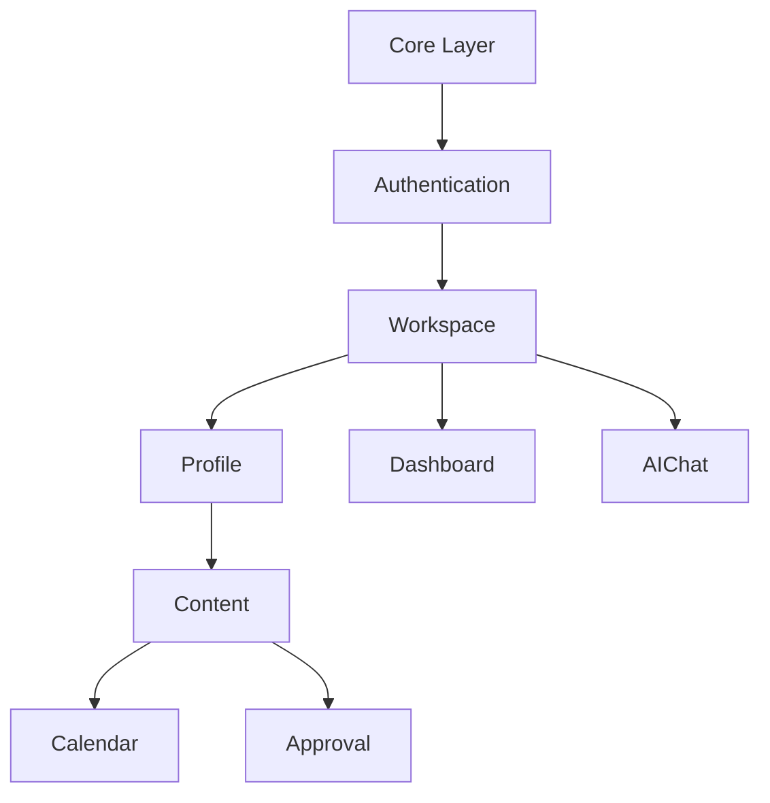

# Đặc Tả Phân Tách Module Phát Triển Độc Lập (Module Specification)

Tài liệu này định nghĩa cấu trúc phân mảnh các Module trong dự án Flutter `AISAM-MB` dựa trên mã nguồn Backend và Báo cáo Audit. Mục đích là để chia nhỏ công việc, cho phép nhiều AI Agent lập trình song song trong Giai đoạn 6 mà không gây xung đột (Merge Conflict) hay phụ thuộc chéo vòng lặp (Circular Dependency).

---

## 1. Authentication Module

1. **Tên Module**: Authentication
2. **Mục tiêu nghiệp vụ**: Quản lý đăng nhập, đăng ký và lấy phiên bản gốc của Access Token.
3. **Phạm vi**: 
   - **Bao gồm**: Đăng nhập Email/Password, Đăng ký, Đăng nhập Google, Quên mật khẩu.
   - **Không bao gồm**: Đổi Workspace, cập nhật User Profile.
4. **Màn hình**: `LoginScreen`, `RegisterScreen`, `ForgotPasswordScreen`.
5. **Route Web tương ứng**: `/login`, `/register`, `/forgot-password`
6. **API**: 
   - `POST /api/auth/login`
   - `POST /api/auth/register`
   - `POST /api/auth/google-login`
   - `POST /api/auth/refresh`
7. **Flutter Models**: `AuthRequest`, `AuthResponseModel`, `UserModel`.
8. **Repository**: `AuthRepository`
9. **State Management**: `AuthState` (Initial, Loading, Authenticated, Unauthenticated, Error).
10. **Shared Dependency**: Core Network (ApiClient), Core Storage (SecureStorage).
11. **Business Flow**: Input Credentials ➔ Validate ➔ POST `/login` ➔ Save Token ➔ Redirect `/overview`.
12. **Permission**: Guest (Không cần Header Workspace/Profile).
13. **File Upload**: Không.
14. **Offline**: Không hỗ trợ (buộc phải Online).
15. **Notification**: Không.
16. **Độ ưu tiên**: **P0** (Bắt buộc làm đầu tiên).
17. **Độ phức tạp**: Medium.
18. **Rủi ro**: Quản lý luồng xử lý lỗi 401 khi Refresh Token chéo, Google OAuth Deep Link.
19. **Điều kiện hoàn thành**: Đăng nhập thành công và lưu Token vào `SecureStorage`.

---

## 2. Workspace Module

1. **Tên Module**: Workspace
2. **Mục tiêu nghiệp vụ**: Lựa chọn hoặc tạo Không gian làm việc. Đây là Context bắt buộc của toàn bộ API hệ thống (Header `X-Workspace-Id`).
3. **Phạm vi**: 
   - **Bao gồm**: Liệt kê Workspace, Chọn Workspace, Tạo mới, Mời thành viên.
   - **Không bao gồm**: Dashboard chi tiết bên trong Workspace.
4. **Màn hình**: `OverviewScreen` (Chọn Workspace), `CreateWorkspaceScreen`, `WorkspaceSettingsScreen`.
5. **Route Web tương ứng**: `/workspaces`
6. **API**: 
   - `GET /api/workspaces`
   - `POST /api/workspaces`
   - `GET /api/workspaces/{id}`
   - `POST /api/workspaces/{id}/members`
7. **Flutter Models**: `WorkspaceModel`, `WorkspaceMemberModel`, `CreateWorkspaceRequest`.
8. **Repository**: `WorkspaceRepository`
9. **State Management**: `WorkspaceListState`, `ActiveWorkspaceState`.
10. **Shared Dependency**: Authentication (Bắt buộc phải có Access Token).
11. **Business Flow**: Load list ➔ Chọn Item ➔ Save `activeWorkspaceId` ➔ Redirect `/dashboard`.
12. **Permission**: User hợp lệ (Bearer Token).
13. **File Upload**: Không.
14. **Offline**: Cache danh sách Workspace tạm thời (Optional).
15. **Notification**: Push thông báo có lời mời vào Workspace mới.
16. **Độ ưu tiên**: **P0** (Bắt buộc làm sau Auth).
17. **Độ phức tạp**: Easy.
18. **Rủi ro**: Lỗi mất đồng bộ `X-Workspace-Id` trong Interceptor nếu State thay đổi nhưng Storage chưa lưu kịp.
19. **Điều kiện hoàn thành**: Bấm chọn Workspace, đổi trạng thái Header Interceptor thành công.

---

## 3. Profile (Brand/Product) Module

1. **Tên Module**: Profile
2. **Mục tiêu nghiệp vụ**: Định hình hồ sơ thương hiệu (Profile) và sản phẩm, phục vụ làm ngữ cảnh (`X-Profile-Id`) cho AI khi generate nội dung.
3. **Phạm vi**: 
   - **Bao gồm**: Tạo/Sửa Profile, Quản lý Brand/Product của Workspace đó.
   - **Không bao gồm**: Sinh nội dung bài viết.
4. **Màn hình**: `ProfileListScreen`, `ProfileDetailScreen`, `BrandManagementScreen`.
5. **Route Web tương ứng**: `/profiles`, `/brands`, `/products`
6. **API**: 
   - `GET /api/profiles` (Kèm Header `X-Workspace-Id`)
   - `POST /api/profiles`
   - `GET /api/brands`
   - `GET /api/products`
7. **Flutter Models**: `ProfileModel`, `BrandModel`, `ProductModel`.
8. **Repository**: `ProfileRepository`, `BrandRepository`.
9. **State Management**: `ProfileState`, `BrandListState`.
10. **Shared Dependency**: Workspace (Cần `X-Workspace-Id`).
11. **Business Flow**: Vào Dashboard ➔ Load Profiles ➔ Chọn/Thêm Brand/Product.
12. **Permission**: `X-Workspace-Id`.
13. **File Upload**: Image (AvatarUrl, Brand Logo).
14. **Offline**: Không.
15. **Notification**: Không.
16. **Độ ưu tiên**: **P1**.
17. **Độ phức tạp**: Medium.
18. **Rủi ro**: Logic liên kết quan hệ 3 lớp Profile ➔ Brand ➔ Product.
19. **Điều kiện hoàn thành**: CRUD thành công Brand/Product.

---

## 4. Content (AI & Social) Module

1. **Tên Module**: Content
2. **Mục tiêu nghiệp vụ**: Quản lý vòng đời bài viết (Tạo bằng AI, duyệt, lên lịch mạng xã hội).
3. **Phạm vi**: 
   - **Bao gồm**: Tạo bài bằng AI, Chỉnh sửa văn bản/hình ảnh, Xem danh sách Content.
   - **Không bao gồm**: Lịch hiển thị dạng tháng (Calendar).
4. **Màn hình**: `ContentListScreen`, `CreateContentScreen` (AI Generator), `ContentEditorScreen`.
5. **Route Web tương ứng**: `/content`
6. **API**: 
   - `GET /api/content`
   - `POST /api/content`
   - `POST /api/content/media/upload`
   - `POST /api/social/callback`
7. **Flutter Models**: `ContentModel`, `MediaUploadModel`, `ContentStatusEnum`.
8. **Repository**: `ContentRepository`, `MediaRepository`.
9. **State Management**: `ContentListState`, `ContentEditorState`.
10. **Shared Dependency**: Workspace (`X-Workspace-Id`), Profile (`X-Profile-Id`).
11. **Business Flow**: Bấm nút Generate ➔ Gửi `CreateContentRequest` (Bọc Prompt) ➔ Trả về AI Content ➔ Chỉnh sửa ➔ Lưu ➔ PendingApproval.
12. **Permission**: Role `ContentCreator` hoặc `Owner`.
13. **File Upload**: Image, Video (MediaUpload endpoint). Bắt buộc multipart.
14. **Offline**: Có thể cache bài nháp (`Draft`) cục bộ (Hive/Isar) trước khi upload.
15. **Notification**: Thông báo bài viết sinh xong (Nếu AI sinh bất đồng bộ).
16. **Độ ưu tiên**: **P1**.
17. **Độ phức tạp**: Hard.
18. **Rủi ro**: File Upload quá dung lượng (Large Upload), timeout của AI Generator API (>15s).
19. **Điều kiện hoàn thành**: AI sinh ra bài viết, kèm ảnh, upload thành công và chuyển trạng thái `PendingApproval`.

---

## 5. Calendar & Approval Module

1. **Tên Module**: Calendar
2. **Mục tiêu nghiệp vụ**: Trình bày trạng thái nội dung trực quan trên lịch, phân quyền phê duyệt bài viết trước khi xuất bản.
3. **Phạm vi**: 
   - **Bao gồm**: Lịch đa chế độ (Tháng/Tuần), luồng phê duyệt (Approve/Reject).
   - **Không bao gồm**: Trình soạn thảo văn bản.
4. **Màn hình**: `CalendarScreen`, `ApprovalScreen` (BottomSheet).
5. **Route Web tương ứng**: `/calendar`, `/approvals`
6. **API**: 
   - `GET /api/content` (Dùng chung bộ lọc StartDate/EndDate).
   - `PUT /api/content/{id}/status`
7. **Flutter Models**: `ContentModel`, `ContentStatusEnum`.
8. **Repository**: `ApprovalRepository` (Tái sử dụng Content API Client).
9. **State Management**: `CalendarFilterState`, `ApprovalState`.
10. **Shared Dependency**: Content Module (Sử dụng Model chung).
11. **Business Flow**: Xem lịch ➔ Bấm vào bài `Pending` ➔ Đọc nội dung ➔ Bấm Approve ➔ Chuyển `Approved`.
12. **Permission**: Chỉ `Owner` hoặc `Manager` mới gọi được API duyệt bài. `Viewer` chỉ xem.
13. **File Upload**: Không.
14. **Offline**: Cache các sự kiện lịch tháng hiện tại để xem nhanh.
15. **Notification**: Push Notification "Có 1 bài viết chờ bạn phê duyệt".
16. **Độ ưu tiên**: **P2**.
17. **Độ phức tạp**: Hard (UI Calendar vẽ phức tạp).
18. **Rủi ro**: Timezone (UTC vs LocalTime của thiết bị di động gây lệch ngày trên lịch).
19. **Điều kiện hoàn thành**: Vẽ đúng sự kiện trên lịch theo múi giờ thiết bị, phân quyền ẩn/hiện nút Approve chuẩn xác.

---

## 6. AI Chat (Workspace Chatbot) Module

1. **Tên Module**: AI Chat
2. **Mục tiêu nghiệp vụ**: Trợ lý ảo AI đàm thoại với người dùng về bối cảnh thương hiệu/chiến dịch.
3. **Phạm vi**: 
   - **Bao gồm**: UI Chat (Bong bóng chat), Lịch sử đàm thoại.
   - **Không bao gồm**: Chỉnh sửa bài viết.
4. **Màn hình**: `ChatListScreen`, `ChatDetailScreen`.
5. **Route Web tương ứng**: `/chat`
6. **API**: 
   - `GET /api/conversations`
   - `POST /api/conversations/ask`
7. **Flutter Models**: `ConversationModel`, `ConversationMessageModel`.
8. **Repository**: `ChatRepository`.
9. **State Management**: `ChatSessionState`.
10. **Shared Dependency**: Workspace.
11. **Business Flow**: Mở Chat ➔ Type câu hỏi ➔ Add bubble "User" ➔ Chờ API ➔ Add bubble "AI".
12. **Permission**: `X-Workspace-Id`.
13. **File Upload**: Không (Chỉ Text chat, trừ khi Backend hỗ trợ Vision - UNKNOWN).
14. **Offline**: Lưu SQLite (Isar) lịch sử chat.
15. **Notification**: Không.
16. **Độ ưu tiên**: **P2**.
17. **Độ phức tạp**: Medium.
18. **Rủi ro**: Timeout AI xử lý chậm, Streaming response (Nếu Backend hỗ trợ SSE/WebSocket thì phải bắt Stream thay vì Future). Dựa theo DTO hiện tại thì là request-response đồng bộ.
19. **Điều kiện hoàn thành**: UI Chat mượt mà (cuộn tự động xuống đáy), nhận response AI.

---

## PHẦN TỔNG KẾT & CHIẾN LƯỢC PHÁT TRIỂN (AI AGENT STRATEGY)

### 1. Dependency Graph (Luồng Phụ Thuộc)

### 2. Đề xuất Thứ tự Phát triển (Development Order)

Phải phát triển theo chiều dọc của Đồ thị phụ thuộc:
- **Sprint 1 (Khóa nền tảng)**: Authentication ➔ Workspace
- **Sprint 2 (Khóa nghiệp vụ AI)**: Profile ➔ Content
- **Sprint 3 (Mở rộng tính năng)**: Calendar & Approval ➔ AI Chat

### 3. Đề xuất Module làm SONG SONG (Parallelized by multiple AI Agents)

Sau khi Sprint 1 (Auth + Workspace) hoàn thành và chốt xong Header Interceptor. **Sprint 2 và 3 có thể chia nhỏ cho nhiều Agent hoạt động CÙNG LÚC**:
- **Agent A**: Code `Profile Module` (Quản lý Brand/Product).
- **Agent B**: Code `Content Module` (Gọi AI, Upload File).
- **Agent C**: Code `AI Chat Module` (Làm UI Chatbot).

Lý do: 3 Module này **KHÔNG** gọi API của nhau, chúng chỉ gọi API của Backend và sử dụng `X-Workspace-Id` có sẵn trong Storage. Việc phát triển 3 Module này song song sẽ không gây conflict về logic.

### 4. Liệt kê Module KHÔNG NÊN làm song song

- ❌ **Authentication & Workspace**: Hai module này quyết định vòng đời của toàn bộ App (State Router Guard, Interceptor Injection). Phải code tuần tự. Nếu cho 2 Agent làm song song Auth và Workspace, dễ sinh ra Conflict ở tệp `secure_storage.dart` hoặc `router.dart`.
- ❌ **Content & Calendar & Approval**: Không chia Calendar cho Agent C nếu Content chưa code xong. Vì `Calendar` và `Approval` phụ thuộc chặt chẽ vào `ContentModel` (Dùng chung DTO trả về). Agent Code Calendar cần Import `content_model.dart`, nếu file này chưa tồn tại sẽ lỗi Compilation toàn hệ thống. Cần một Agent làm từ đầu đến cuối nhánh Content ➔ Calendar.
