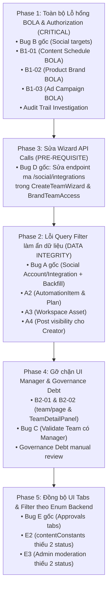

# AISAM — Master Change Plan (v2 — cập nhật sau Pattern Sweep Audit)
**Ngày cập nhật:** 11/09/2026  
**Trạng thái quy trình:** `Audit ✅ → Report ✅ → Pattern Sweep ✅ → Master Change Plan v2 (chờ duyệt) → Human Approval → Implement → Verify`  
**Nguyên tắc:** Kế hoạch thay đổi toàn diện (v2) tích hợp toàn bộ các phát hiện từ Audit ban đầu (Bug A–E) và 10 instance mới phát hiện từ Pattern Sweep Audit (`A2`, `A3`, `A4`, `B1-01`, `B1-02`, `B1-03`, `B2-01`, `B2-02`, `E2`, `E3`). **KHÔNG viết code thật, KHÔNG sửa file sản phẩm, KHÔNG chạy migration trong tài liệu này.**

---

## MỤC LỤC

1. [Tổng quan cấu trúc Phase mới (Security-First Re-sequencing)](#1-tổng-quan-cấu-trúc-phase-mới-security-first-re-sequencing)
2. [Cảnh báo mâu thuẫn kỹ thuật tiềm ẩn giữa các Fix](#2-cảnh-báo-mâu-thuẫn-kỹ-thuật-tiềm-ẩn-giữa-các-fix)
3. [Phase 1 — Toàn bộ lỗ hổng BOLA & Authorization (Security-Critical)](#3-phase-1--toàn-bộ-lỗ-hổng-bola--authorization-security-critical)
   - [Bug B gốc: Social Account Link Targets & ResourcePermissionFilter](#bug-b-gốc-social-account-link-targets--resourcepermissionfilter)
   - [B1-01: ContentScheduleService & Controller — Thiếu Actor & Bỏ lọt ResourcePermissionFilter](#b1-01-contentscheduleservice--controller--thiếu-actor--bỏ-lọt-resourcepermissionfilter)
   - [B1-02: ProductService & Controller — Bỏ xó tham số userId & Route Param](#b1-02-productservice--controller--bỏ-xó-tham-số-userid--route-param)
   - [B1-03: AdCampaignService — Chỉ check WorkspaceMember, bỏ qua Team-Brand](#b1-03-adcampaignservice--chỉ-check-workspacemember-bỏ-qua-team-brand)
   - [Kiểm tra Audit Trail (Bảng audit_logs)](#kiểm-tra-audit-trail-bảng-audit_logs)
4. [Phase 2 — Lỗi Query Filter làm ẩn nhầm dữ liệu (Visibility & Data Integrity)](#4-phase-2--lỗi-query-filter-làm-ẩn-nhầm-dữ-liệu-visibility--data-integrity)
   - [Bug A gốc: SocialIntegration & SocialAccount + Backfill TeamChannelAccess](#bug-a-gốc-socialintegration--socialaccount--backfill-teamchannelaccess)
   - [A2: AutomationItem & AutomationPlan — Nới lỏng filter & Fix Middleware](#a2-automationitem--automationplan--nới-lỏng-filter--fix-middleware)
   - [A3: Asset — Sửa Fallback Guid.Empty để bảo toàn Asset dùng chung Workspace](#a3-asset--sửa-fallback-guidempty-để-bảo-toàn-asset-dùng-chung-workspace)
   - [A4: Post — Nới lỏng cho Content Creator & Kiểm soát rò rỉ Analytics](#a4-post--nới-lỏng-cho-content-creator--kiểm-soát-rò-rỉ-analytics)
   - [Đánh giá nhu cầu Data Migration / Backfill cho A2, A3, A4](#đánh-giá-nhu-cầu-data-migration--backfill-cho-a2-a3-a4)
5. [Phase 3 — Bug D: Sửa Endpoint sai trong CreateTeamWizard & BrandTeamAccess](#5-phase-3--bug-d-sửa-endpoint-sai-trong-createteamwizard--brandteamaccess)
6. [Phase 4 — Gỡ chặn UI cho Manager & Governance Debt (Non-security)](#6-phase-4--gỡ-chặn-ui-cho-manager--governance-debt-non-security)
   - [B2-01: Frontend Team Page (team/page.tsx) — Cho phép Manager thao tác](#b2-01-frontend-team-page-teampagetsx--cho-phép-manager-thao-tác)
   - [B2-02: Component TeamDetailPanel — Phân quyền Manager của Team](#b2-02-component-teamdetailpanel--phân-quyền-manager-của-team)
   - [Bug C: Validate Team phải có Manager trước khi gán Brand](#bug-c-validate-team-phải-có-manager-trước-khi-gán-brand)
   - [Governance Debt List (Bug C) — Cần Kiet duyệt thủ công](#governance-debt-list-bug-c--cần-kiet-duyệt-thủ-công)
7. [Phase 5 — Đồng bộ hóa UI Tabs & Filter với Enum Backend](#7-phase-5--đồng-bộ-hóa-ui-tabs--filter-với-enum-backend)
   - [Bug E gốc: Khôi phục Tabs Approved/Published/Failed/Rejected trên Approvals](#bug-e-gốc-khôi-phục-tabs-approvedpublishedfailedrejected-trên-approvals)
   - [E2: contentConstants.tsx — Bổ sung Flagged & RejectedByPlatform](#e2-contentconstantstsx--bổ-sung-flagged--rejectedbyplatform)
   - [E3: Admin Content Moderation — Bổ sung RejectedByPlatform & Failed](#e3-admin-content-moderation--bổ-sung-rejectedbyplatform--failed)
8. [Đã rà soát, xác nhận sạch (Clean Bill of Health cho Pattern C & D)](#8-đã-rà-soát-xác-nhận-sạch-clean-bill-of-health-cho-pattern-c--d)
9. [Migration Scripts Tổng hợp](#9-migration-scripts-tổng-hợp)
10. [Test Plan tổng hợp (Unit, Integration, Role Matrix)](#10-test-plan-tổng-hợp-unit-integration-role-matrix)
11. [Rollback Plan cho từng Phase](#11-rollback-plan-cho-từng-phase)
12. [Danh sách File thay đổi tổng hợp](#12-danh-sách-file-thay-đổi-tổng-hợp)
13. [User Review Required & Quyết định cần phê duyệt](#13-user-review-required--quyết-định-cần-phê-duyệt)

---

## 1. TỔNG QUAN CẤU TRÚC PHASE MỚI (SECURITY-FIRST RE-SEQUENCING)

Thay vì chia theo các tầng kỹ thuật (Data / Service / UI), Change Plan v2 được tái cấu trúc theo **nguyên tắc trọng số an ninh (Security-First)**: xử lý triệt để các lỗ hổng BOLA/IDOR nghiêm trọng trước, tiếp đến là tính toàn vẹn dữ liệu / hiển thị, sau đó là điều kiện tiên quyết UI (Wizard), gỡ chặn quyền quản trị, và cuối cùng là đồng bộ giao diện.



| Phase | Trọng tâm | Mức độ nghiêm trọng | Rủi ro nếu không làm ngay |
| :--- | :--- | :---: | :--- |
| **Phase 1** | **Toàn bộ BOLA / Authorization** | 🔴 **CRITICAL** | Thành viên bất kỳ (kể cả Viewer) có thể sửa/xóa Lịch đăng bài (`B1-01`), sửa Product (`B1-02`), tạo Campaign (`B1-03`), hoặc chiếm quyền Social Account (`Bug B`). |
| **Phase 2** | **Query Filter & Data Visibility** | 🟠 **HIGH** | Dữ liệu bị ẩn vô lý: Member không thấy Social Account (`Bug A`), mất Automation Plan (`A2`), mất Asset dùng chung (`A3`), Creator không thấy Post của mình (`A4`). |
| **Phase 3** | **Wizard Integration API Call** | 🟡 **MEDIUM** | Wizard tạo Team bị sập ngầm khi nạp kênh xã hội, làm tắc nghẽn luồng test và tạo dữ liệu phân quyền thực tế. |
| **Phase 4** | **UI Manager & Governance Debt** | 🔵 **LOW-MEDIUM** | Manager bị ẩn nút UI quản lý team dù backend cho phép (`B2-01/02`); Team bị gán Brand mà không có Manager (`Bug C`). |
| **Phase 5** | **Khôi phục UI Tabs & Filter** | 🟢 **LOW (UX)** | Thiếu tab/option lọc cho các trạng thái `Approved`, `Published`, `Rejected`, `Flagged`, `Failed`. |

---

## 2. CẢNH BÁO MÂU THUẪN KỸ THUẬT TIỀM ẨN GIỮA CÁC FIX

> [!CAUTION]
> **CẢNH BÁO MÂU THUẪN 1: Nới lỏng Query Filter của `Post` (Phase 2 — `A4`) va chạm với `ResourcePermissionFilter` (Phase 1).**
> - **Nguy cơ:** Tại Phase 2 (`A4`), ta nới lỏng EF Core Query Filter để Content Creator (`c.CreatedBy == PermissionActorId`) có thể xem danh sách `Post` mà chính mình tạo ra kể cả khi chưa có quyền trên Kênh.
> - **Va chạm:** Tại [ResourcePermissionFilter.cs#L51-L53](file:///c:/tai%20lieu/AISAM-FINAL/AISAM-BE/AISAM.API/Middleware/ResourcePermissionFilter.cs#L51-L53):
>   ```csharp
>   if(ids.TryGetValue("postId", out var postId)) {
>       if(!await Check(AccessResourceKind.Post, postId, ResourcePermission.PostView)) return;
>       ...
>   }
>   ```
>   Nếu `AccessControlService.CheckAsync` cho `AccessResourceKind.Post` vẫn kiểm tra quyền kênh (`PermissionChannelIds.Contains(...)`), thì khi Creator click vào xem chi tiết bài đăng (`GET /posts/{postId}`), request sẽ bị `ResourcePermissionFilter` chặn `403 ACCESS_DENIED`!
> - **Giải pháp bắt buộc:** Tại Phase 1 khi sửa `AccessControlService`, phải cập nhật logic cho `AccessResourceKind.Post`: Cho phép `PostView` nếu `post.Content.CreatedBy == actorUserId` (chỉ xem metadata bài đăng), nhưng **tuyệt đối không** cho phép `PostDelete` hoặc truy cập các số liệu Analytics chi tiết nếu không có quyền kênh.

> [!WARNING]
> **CẢNH BÁO MÂU THUẪN 2: Nguy cơ rò rỉ Analytics / Financial Metrics khi nới lỏng `Post` cho Creator.**
> - Nếu nới lỏng `Post`, cần đảm bảo các controller/endpoint thống kê doanh thu / chi phí ads (`AnalyticsController`, `AdMetricsController`) KHÔNG truy vấn dựa trên `db.Posts` nới lỏng mà phải truy vấn dựa trên kênh (`SocialIntegration` / `AdAccount`) được cấp quyền.

---

## 3. PHASE 1 — TOÀN BỘ LỖ HỔNG BOLA & AUTHORIZATION (SECURITY-CRITICAL)

### Bug B gốc: Social Account Link Targets & ResourcePermissionFilter
- **Vị trí:** 
  - [SocialService.cs#L335-L341](file:///c:/tai%20lieu/AISAM-FINAL/AISAM-BE/AISAM.Services/Service/SocialService.cs#L335-L341)
  - [ResourcePermissionFilter.cs#L24-L28](file:///c:/tai%20lieu/AISAM-FINAL/AISAM-BE/AISAM.API/Middleware/ResourcePermissionFilter.cs#L24-L28)
  - [SocialAccountsController.cs#L81-L84](file:///c:/tai%20lieu/AISAM-FINAL/AISAM-BE/AISAM.API/Controllers/SocialAccountsController.cs#L81-L84)
- **Mô tả thay đổi:**
  1. Trong `SocialService.cs`, method `LinkSelectedTargetsInWorkspaceAsync`:
     - Nhận thêm tham số `Guid actorUserId`.
     - Gọi `IAccessControlService.CheckAsync` để kiểm tra quyền `ResourcePermission.BrandManage` của actor trên `request.BrandId`.
     - Nếu `!decision.Allowed` → ném `UnauthorizedAccessException("Not authorized to manage target brand.")`.
  2. Trong `ResourcePermissionFilter.cs`:
     - Cho phép Manager vượt qua filter để vào OAuth flow / Target operations (`if(!db.PermissionOwner && !db.PermissionManager) { 403; }`).
     - ContentCreator và Viewer vẫn bị chặn 403 tại filter.
     - Manager khi đi qua filter sẽ được kiểm soát chặt chẽ bởi Service-layer BOLA check ở trên.

---

### B1-01: ContentScheduleService & Controller — Thiếu Actor & Bỏ lọt ResourcePermissionFilter
- **Vị trí:**
  - Controller: [ContentSchedulesController.cs#L68-L94](file:///c:/tai%20lieu/AISAM-FINAL/AISAM-BE/AISAM.API/Controllers/ContentSchedulesController.cs#L68-L94)
  - Service: [ContentScheduleService.cs#L250-L277](file:///c:/tai%20lieu/AISAM-FINAL/AISAM-Services/Calendar/ContentScheduleService.cs#L250-L277)
  - Filter: [ResourcePermissionFilter.cs#L51-L85](file:///c:/tai%20lieu/AISAM-FINAL/AISAM-BE/AISAM.API/Middleware/ResourcePermissionFilter.cs#L51-L85)
- **Mô tả thay đổi:**
  1. **Tại `ResourcePermissionFilter.cs`:** Bổ sung trường hợp nhận diện `scheduleId`:
     ```csharp
     if (ids.TryGetValue("scheduleId", out var scheduleId))
     {
         var sched = await db.ContentCalendars.AsNoTracking().FirstOrDefaultAsync(s => s.Id == scheduleId, ct);
         if (sched is null) { context.Result = new NotFoundResult(); return; }
         // Check Brand permission
         var requiredPerm = read ? ResourcePermission.ContentView : ResourcePermission.PostPublish;
         if (!await Check(AccessResourceKind.Brand, sched.BrandId, requiredPerm)) return;
     }
     ```
  2. **Tại `ContentSchedulesController.cs`:** Lấy `actorUserId` từ `UserClaimsHelper.GetUserIdOrThrow(User)` và truyền vào Service.
  3. **Tại `ContentScheduleService.cs`:**
     - Sửa signature `DeleteInWorkspaceAsync` và `UpdateInWorkspaceAsync` để nhận `Guid actorUserId`.
     - Kiểm tra quyền: Nếu actor không phải Owner, kiểm tra xem actor có quyền đối với `schedule.BrandId` (thông qua `IAccessControlService` hoặc xác minh `TeamBrand` của actor).
     - Ghi nhận `AuditLog` với đầy đủ `ActorId`, `TargetTable = "content_calendars"`, `ActionType = "schedule.delete"` / `"schedule.update"`.

---

### B1-02: ProductService & Controller — Bỏ xó tham số userId & Route Param
- **Vị trí:**
  - Service: [ProductService.cs#L345-L364](file:///c:/tai%20lieu/AISAM-FINAL/AISAM-Services/Product/ProductService.cs#L345-L364)
  - Controller: [ProductController.cs#L106](file:///c:/tai%20lieu/AISAM-FINAL/AISAM-BE/AISAM.API/Controllers/ProductController.cs#L106)
- **Mô tả thay đổi:**
  1. **Tại `ProductService.cs`:** Cập nhật hàm `IsBrandVisibleInWorkspace`:
     ```csharp
     private async Task<bool> IsBrandAccessibleAsync(Brand brand, Guid workspaceId, Guid userId, CancellationToken ct)
     {
         if (brand.WorkspaceId != workspaceId || brand.IsDeleted) return false;
         var isOwner = await _workspaceMemberRepository.IsOwnerAsync(workspaceId, userId, ct);
         if (isOwner) return true;
         // Kiểm tra user có thuộc team quản lý brand này không
         return await _teamBrandRepository.IsUserAssignedToBrandAsync(workspaceId, userId, brand.Id, ct);
     }
     ```
  2. **Tại `ProductController.cs`:** Đổi route parameter từ `[HttpPut("{id}")]` thành `[HttpPut("{productId}")]` (hoặc cấu hình để `ResourcePermissionFilter` bắt được tham số `id` khi controller là `Product`), đảm bảo chặn ngay từ tầng middleware trước khi vào controller.

---

### B1-03: AdCampaignService — Chỉ check WorkspaceMember, bỏ qua Team-Brand
- **Vị trí:** [AdCampaignService.cs#L117-L157](file:///c:/tai%20lieu/AISAM-FINAL/AISAM-Services/Ads/AdCampaignService.cs#L117-L157), [L215-L245](file:///c:/tai%20lieu/AISAM-FINAL/AISAM-Services/Ads/AdCampaignService.cs#L215-L245)
- **Mô tả thay đổi:**
  1. Trong `CreateCampaignAsync`, `UpdateCampaignAsync`, `DeleteCampaignAsync`:
     - Thay thế việc chỉ gọi `EnsureWorkspaceMemberAsync` bằng bước xác thực quyền Brand:
     ```csharp
     if (request.BrandId.HasValue && request.BrandId.Value != Guid.Empty)
     {
         var decision = await _accessControl.CheckAsync(
             new AccessRequest(actorUserId, workspaceId, AccessResourceKind.Brand, request.BrandId.Value, ResourcePermission.BrandManage),
             cancellationToken);
         if (!decision.Allowed)
             return GenericResponse<CampaignResponse>.Forbidden("You do not have permission to manage campaigns for this brand");
     }
     ```

---

### Kiểm tra Audit Trail (Bảng `audit_logs`)

> [!IMPORTANT]
> **Yêu cầu bắt buộc:** Trước khi coi các lỗ hổng BOLA trên chỉ là rủi ro trên lý thuyết, Kiet cần chạy câu lệnh query read-only dưới đây trên database (Staging & Production) để kiểm tra xem đã từng có trường hợp xóa/sửa trái phép nào xảy ra trong quá khứ chưa.

```sql
-- QUERY KIỂM TRA AUDIT TRAIL: Phát hiện các thao tác sửa/xóa tài nguyên từ user không thuộc Team quản lý Brand
SELECT 
    al.id AS "AuditLogId",
    al.created_at AS "Timestamp",
    al.actor_id AS "ActorUserId",
    u.email AS "ActorEmail",
    wm.role AS "WorkspaceRole",
    al.action_type AS "Action",
    al.target_table AS "TargetTable",
    al.target_id AS "TargetResourceId",
    al.workspace_id AS "WorkspaceId"
FROM audit_logs al
JOIN users u ON u.id = al.actor_id
LEFT JOIN workspace_members wm ON wm.user_id = al.actor_id AND wm.workspace_id = al.workspace_id
WHERE al.target_table IN ('content_calendars', 'products', 'campaigns', 'ad_campaigns')
  AND al.action_type ILIKE ANY (ARRAY['%delete%', '%update%'])
  AND (wm.role IS NULL OR wm.role != 1) -- 1 = Owner (bỏ qua Owner vì Owner có quyền toàn cục)
  AND NOT EXISTS (
      -- 1. Nếu là content_calendars:
      SELECT 1 FROM content_calendars cc
      JOIN team_brands tb ON tb.brand_id = cc.brand_id AND tb.is_active = true
      JOIN team_members tm ON tm.team_id = tb.team_id AND tm.user_id = al.actor_id AND tm.is_active = true
      WHERE cc.id = al.target_id
      UNION
      -- 2. Nếu là products:
      SELECT 1 FROM products p
      JOIN team_brands tb ON tb.brand_id = p.brand_id AND tb.is_active = true
      JOIN team_members tm ON tm.team_id = tb.team_id AND tm.user_id = al.actor_id AND tm.is_active = true
      WHERE p.id = al.target_id
      UNION
      -- 3. Nếu là ad_campaigns:
      SELECT 1 FROM ad_campaigns ac
      JOIN team_brands tb ON tb.brand_id = ac.brand_id AND tb.is_active = true
      JOIN team_members tm ON tm.team_id = tb.team_id AND tm.user_id = al.actor_id AND tm.is_active = true
      WHERE ac.id = al.target_id
  )
ORDER BY al.created_at DESC;
```
*Ghi chú: Nếu query trả về 0 dòng, chứng tỏ chưa có vụ khai thác BOLA nào xảy ra trong lịch sử lưu log.*

---

## 4. PHASE 2 — LỖI QUERY FILTER LÀM ẨN NHẦM DỮ LIỆU (VISIBILITY & DATA INTEGRITY)

### Bug A gốc: SocialIntegration & SocialAccount + Backfill TeamChannelAccess
- **Vị trí:** [AisamContext.PermissionScope.cs#L40-L41](file:///c:/tai%20lieu/AISAM-FINAL/AISAM-BE/AISAM.Infrastructure/Context/AisamContext.PermissionScope.cs#L40-L41) & [PermissionScopeMiddleware.cs#L34-L35](file:///c:/tai%20lieu/AISAM-FINAL/AISAM-BE/AISAM.API/Middlewares/PermissionScopeMiddleware.cs#L34-L35)
- **Giải pháp:**
  1. Chạy SQL Backfill để cấp `CanView = true` trong `team_channel_access` cho mọi `TeamBrand` đang active.
  2. Bổ sung kênh của các Brand mà Manager quản lý vào `PermissionChannelIds` trong `PermissionScopeMiddleware.cs` để phá vỡ Circular Dependency.

---

### A2: AutomationItem & AutomationPlan — Nới lỏng filter & Fix Middleware
- **Vị trí:**
  - Filter: [AisamContext.PermissionScope.cs#L50](file:///c:/tai%20lieu/AISAM-FINAL/AISAM-BE/AISAM.Infrastructure/Context/AisamContext.PermissionScope.cs#L50)
  - Middleware: [PermissionScopeMiddleware.cs#L47-L49](file:///c:/tai%20lieu/AISAM-FINAL/AISAM-BE/AISAM.API/Middlewares/PermissionScopeMiddleware.cs#L47-L49)
- **Mô tả thay đổi:**
  1. **Tại `AisamContext.PermissionScope.cs`:**
     ```csharp
     m.Entity<AutomationItem>().HasQueryFilter(i =>
         !PermissionScopeEnabled ||
         (PermissionOwner ||
          (AutomationPlans.Any(p => p.Id == i.AutomationPlanId) &&
           (!i.BrandId.HasValue || PermissionBrandIds.Contains(i.BrandId.Value)))));
     ```
  2. **Tại `PermissionScopeMiddleware.cs`:**
     Sửa điều kiện `.All(...)` khi tính `PermissionPlanIds`:
     ```csharp
     var planIds = await db.AutomationPlans.AsNoTracking()
         .Where(p => !p.Items.Any() || p.Items.All(i => !i.BrandId.HasValue || allowedBrandIds.Contains(i.BrandId.Value)))
         .Select(p => p.Id).ToListAsync();
     ```
     *Lợi ích:* Kế hoạch chứa các item chung hoặc chưa gán Brand sẽ không bị ẩn mất khỏi người dùng.

---

### A3: Asset — Sửa Fallback Guid.Empty để bảo toàn Asset dùng chung Workspace
- **Vị trí:** [AisamContext.PermissionScope.cs#L63-L64](file:///c:/tai%20lieu/AISAM-FINAL/AISAM-BE/AISAM.Infrastructure/Context/AisamContext.PermissionScope.cs#L63-L64)
- **Mô tả thay đổi:**
  ```csharp
  m.Entity<Asset>().HasQueryFilter(a =>
      !PermissionScopeEnabled ||
      (PermissionOwner ||
       (!a.BrandId.HasValue && a.WorkspaceId == PermissionWorkspaceId) || // Cho phép Asset dùng chung toàn workspace
       (PermissionBrandIds.Contains(a.BrandId.Value) && (PermissionManager || a.UploadedBy == PermissionActorId))));
  ```
  *Lợi ích:* Bỏ việc so khớp `Guid.Empty` trong `PermissionBrandIds`. Mọi thành viên trong workspace đều xem và tái sử dụng được logo/tài nguyên chung cấp workspace.

---

### A4: Post — Nới lỏng cho Content Creator & Kiểm soát rò rỉ Analytics
- **Vị trí:** [AisamContext.PermissionScope.cs#L43](file:///c:/tai%20lieu/AISAM-FINAL/AISAM-BE/AISAM.Infrastructure/Context/AisamContext.PermissionScope.cs#L43)
- **Mô tả thay đổi:**
  ```csharp
  m.Entity<Post>().HasQueryFilter(p =>
      !PermissionScopeEnabled ||
      (PermissionOwner ||
       Contents.Any(c => c.Id == p.ContentId &&
           (c.CreatedBy == PermissionActorId || // Tác giả luôn xem được bài đăng của mình
            SocialIntegrations.Any(i => i.Id == p.IntegrationId && i.BrandId == c.BrandId && i.WorkspaceId == c.WorkspaceId)))));
  ```
- **Kiểm soát rò rỉ Analytics:**
  - Entity `Post` chỉ cung cấp thông tin bài viết (`Title`, `ContentText`, `PublishedAt`, `Status`).
  - Các bảng thống kê hiệu suất chuyên sâu (`PostAnalytics`, `AdPerformanceMetrics`) giữ nguyên QueryFilter bắt buộc theo `PermissionChannelIds`. Content Creator không được cấp quyền kênh thì không thể truy xuất dữ liệu số liệu tài chính/doanh thu.

---

### Đánh giá nhu cầu Data Migration / Backfill cho A2, A3, A4

| Entity | Khảo sát thực tế dữ liệu | Có cần Backfill SQL không? | Kết luận & Phương án xử lý |
| :--- | :--- | :---: | :--- |
| **`AutomationItem` (`A2`)** | `BrandId` là `Guid?` (nullable). Khi tạo từ template, item chưa gắn Brand là nghiệp vụ hoàn toàn hợp lệ. | **KHÔNG** | Không có dữ liệu rác cần dọn. Chỉ cần sửa logic QueryFilter & Middleware để chấp nhận `BrandId == null`. |
| **`Asset` (`A3`)** | `BrandId == null` đại diện cho Asset dùng chung toàn workspace. | **KHÔNG** | Dữ liệu hoàn toàn hợp lệ. Chỉ cần sửa QueryFilter để cho phép fallback workspace-level asset. |
| **`Post` (`A4`)** | `Post` liên kết với `Content` và `SocialIntegration`. | **KHÔNG** | Mối quan hệ khóa ngoại đã toàn vẹn, chỉ do QueryFilter áp đặt AND quá ngặt nghèo. |

---

## 5. PHASE 3 — BUG D: SỬA ENDPOINT SAI TRONG CREATETEAMWIZARD & BRANDTEAMACCESS

> [!NOTE]
> Phase 3 được giữ ở vị trí này vì là điều kiện tiên quyết để giao diện UI có thể nạp danh sách kênh mạng xã hội, phục vụ việc kiểm thử UI thực tế cho Phase 2 (Bug A) và Phase 4.

- **Vị trí 1:** [CreateTeamWizard.tsx#L89-L107](file:///c:/tai%20lieu/AISAM-FINAL/AISAM-FE/src/components/team/CreateTeamWizard.tsx#L89-L107)
  - Thay thế URL ma `/social/integrations?pageSize=200` bằng service chuẩn:
    ```typescript
    import { getSocialIntegrationsByBrand } from "@/services/socialAccountService";
    // Gọi theo từng Brand đã chọn:
    const results = await Promise.all(selectedBrandIds.map(id => getSocialIntegrationsByBrand(id)));
    setIntegrations(results.flat());
    ```
  - Thay thế `catch { // ignore }` bằng log lỗi và set state hiển thị banner thông báo nếu nạp kênh thất bại.
- **Vị trí 2:** [BrandTeamAccess.tsx#L54](file:///c:/tai%20lieu/AISAM-FINAL/AISAM-FE/src/components/brands/BrandTeamAccess.tsx#L54)
  - Đổi từ `apiClient(/social/integrations?brandId=...)` sang hàm `getSocialIntegrationsByBrand(brandId)`.

---

## 6. PHASE 4 — GỠ CHẶN UI CHO MANAGER & GOVERNANCE DEBT (NON-SECURITY)

### Xác minh Backend trước khi nới lỏng Frontend
Đã kiểm tra kỹ [TeamService.cs#L44-L55](file:///c:/tai%20lieu/AISAM-FINAL/AISAM-BE/AISAM.Services/Access/TeamService.cs#L44-L55) và các hàm `AddMemberAsync`, `RemoveMemberAsync`, `UpdateAsync`:
- Phương thức `RequireTeamManage` đã tự kiểm tra chặt chẽ: Owner được toàn quyền; Manager chỉ được thao tác nếu chính Manager đó là thành viên active của Team (`isTeamMember`).
- **Kết luận:** Backend đã bảo mật hoàn chỉnh! Việc frontend chặn bằng `isOwner` là thừa và gây tê liệt UI của Manager. Đây KHÔNG PHẢI lỗ hổng BOLA mới.

---

### B2-01: Frontend Team Page (`team/page.tsx`) — Cho phép Manager thao tác
- **Vị trí:** [team/page.tsx#L69](file:///c:/tai%20lieu/AISAM-FINAL/AISAM-FE/src/app/(dashboard)/team/page.tsx#L69), [L353](file:///c:/tai%20lieu/AISAM-FINAL/AISAM-FE/src/app/(dashboard)/team/page.tsx#L353), [L577](file:///c:/tai%20lieu/AISAM-FINAL/AISAM-FE/src/app/(dashboard)/team/page.tsx#L577)
- **Thay đổi:**
  - Bổ sung biến kiểm tra quyền: `const canCreateTeam = activeWorkspace?.isOwner === true || activeWorkspace?.isManager === true;`
  - Mở nút `+ Create Team` cho Manager (backend đã hỗ trợ tạo team).
  - Cột `Actions` và các nút chỉnh sửa/xóa team: Hiển thị nếu user là `Owner` HOẶC là Manager thuộc Team đó.

---

### B2-02: Component `TeamDetailPanel` — Phân quyền Manager của Team
- **Vị trí:** [TeamDetailPanel.tsx#L218-L305](file:///c:/tai%20lieu/AISAM-FINAL/AISAM-FE/src/components/team/TeamDetailPanel.tsx#L218-L305)
- **Thay đổi:**
  - Thêm prop hoặc tính toán: `const canManageTeam = isOwner || team.members.some(m => m.userId === currentUserId && m.role === 'Manager');`
  - Thay thế các điều kiện `{isOwner && ...}` tại nút Edit, `+ Add Member`, và nút `Remove` member bằng `{canManageTeam && ...}`.

---

### Bug C: Validate Team phải có Manager trước khi gán Brand
- **Backend:** [AssignmentService.cs#L97-L106](file:///c:/tai%20lieu/AISAM-FINAL/AISAM-BE/AISAM.Services/Access/AssignmentService.cs#L97-L106)
  - Khi gán Brand cho Team (`request.Active == true`), kiểm tra trong `TeamMembers` phải có ít nhất 1 thành viên có `Role == "Manager"` và `IsActive == true`. Nếu không, ném ngoại lệ `TEAM_REQUIRES_MANAGER`.
- **Frontend:** [CreateTeamWizard.tsx#L143-L158](file:///c:/tai%20lieu/AISAM-FINAL/AISAM-FE/src/components/team/CreateTeamWizard.tsx#L143-L158) & [BrandTeamAccess.tsx](file:///c:/tai%20lieu/AISAM-FINAL/AISAM-FE/src/components/brands/BrandTeamAccess.tsx)
  - Tại Step 3 Wizard: Nếu chọn Brand mà Step 2 chưa chọn Manager, `canNext()` trả về `false` kèm cảnh báo trực quan trên UI.

---

### Governance Debt List (Bug C) — Cần Kiet duyệt thủ công

> [!CAUTION]
> **Danh sách dưới đây cần Kiet xem xét thủ công TRƯỚC KHI bật validation "Team phải có Manager".**
> Tuyệt đối không tự động giải quyết bằng script khi chưa có quyết định nghiệp vụ từ con người.

**Query SQL kiểm tra dữ liệu hiện tại (read-only):**
```sql
-- Liệt kê các Team đang được gán Brand active nhưng KHÔNG có bất kỳ Manager nào
SELECT
    tb.team_id AS "TeamId",
    t.name AS "TeamName",
    tb.brand_id AS "BrandId",
    b.name AS "BrandName",
    tb.assigned_at AS "AssignedAt"
FROM team_brands tb
JOIN teams t ON t.id = tb.team_id
JOIN brands b ON b.id = tb.brand_id
WHERE tb.is_active = true
  AND t.is_deleted = false
  AND t.status = 1  -- Active
  AND NOT EXISTS (
      SELECT 1 FROM team_members tm
      WHERE tm.team_id = tb.team_id
        AND tm.role = 'Manager'
        AND tm.is_active = true
  )
ORDER BY t.name, b.name;
```

**Quy trình xử lý Governance Debt:**
1. Kiet chạy query trên Staging/Production và review danh sách các Team vi phạm.
2. Với mỗi Team:
   - Phương án A: Chỉ định 1 thành viên hiện có lên làm Manager.
   - Phương án B: Gỡ Brand assignment khỏi Team đó.
3. Sau khi danh sách trả về 0 dòng vi phạm, tiến hành bật validation trong code backend.

---

## 7. PHASE 5 — ĐỒNG BỘ HÓA UI TABS & FILTER VỚI ENUM BACKEND

### Bug E gốc: Khôi phục Tabs Approved/Published/Failed/Rejected trên Approvals
- **Vị trí:** [approvals/page.tsx#L424-L429](file:///c:/tai%20lieu/AISAM-FINAL/AISAM-FE/src/app/(dashboard)/approvals/page.tsx#L424-L429), [L696-L699](file:///c:/tai%20lieu/AISAM-FINAL/AISAM-FE/src/app/(dashboard)/approvals/page.tsx#L696-L699)
- **Thay đổi:**
  - Khôi phục đủ 6 tabs: `All`, `Pending`, `Approved`, `Published`, `Failed`, `Rejected`.
  - Nạp toàn bộ visible contents bằng `fetchAllVisibleContents` và nạp lịch bài lỗi qua `fetchSchedules({ onlyFailed: true })`.

---

### E2: `contentConstants.tsx` — Bổ sung Flagged & RejectedByPlatform
- **Vị trí:** [contentConstants.tsx#L4-L50](file:///c:/tai%20lieu/AISAM-FINAL/AISAM-FE/src/lib/contentConstants.tsx#L4-L50)
- **Thay đổi:**
  - Cập nhật type `ContentStatus`:
    ```typescript
    export type ContentStatus =
      | "Draft"
      | "Awaiting Approval"
      | "Approved"
      | "Rejected"
      | "Published"
      | "Scheduled"
      | "Failed"
      | "Flagged"
      | "RejectedByPlatform";
    ```
  - Bổ sung 2 entries vào mảng `STATUS_OPTIONS` để người dùng có thể lọc các nội dung bị kiểm duyệt hoặc bị mạng xã hội từ chối đăng.

---

### E3: Admin Content Moderation — Bổ sung RejectedByPlatform & Failed
- **Vị trí:** [admin/content/page.tsx#L9](file:///c:/tai%20lieu/AISAM-FINAL/AISAM-FE/src/app/(admin)/admin/content/page.tsx#L9), [L120-L128](file:///c:/tai%20lieu/AISAM-FINAL/AISAM-FE/src/app/(admin)/admin/content/page.tsx#L120-L128)
- **Thay đổi:**
  - Cập nhật `contentStatusLabels`:
    ```typescript
    const contentStatusLabels: Record<number, string> = {
      0: "Draft",
      1: "Pending",
      2: "Approved",
      3: "Rejected",
      4: "Published",
      5: "Flagged",
      6: "Rejected By Platform",
      7: "Failed",
    };
    ```
  - Bổ sung `<option value="6">Rejected By Platform</option>` và `<option value="7">Failed</option>` vào dropdown lọc trạng thái của Admin.

---

## 8. ĐÃ RÀ SOÁT, XÁC NHẬN SẠCH (CLEAN BILL OF HEALTH CHO PATTERN C & D)

Bảng dưới đây ghi nhận kết quả rà soát toàn diện codebase cho Pattern C và D từ Pattern Sweep Audit Report, xác nhận **KHÔNG CẦN** audit lại các khu vực này trong tương lai trừ khi có thay đổi code liên quan:

### 1. Rà soát Pattern C (Bỏ sót validate, return true vô điều kiện):
- [CreateCampaignModal.tsx](file:///c:/tai%20lieu/AISAM-FINAL/AISAM-FE/src/components/campaign/CreateCampaignModal.tsx): Xác nhận đã validate bắt buộc `name` và `brandId` trước khi gọi submit.
- [CreateContentModal.tsx](file:///c:/tai%20lieu/AISAM-FINAL/AISAM-FE/src/components/content/CreateContentModal.tsx): Xác nhận đã validate bắt buộc `title`, `brandId`, `contentText`.
- [BulkScheduleModal.tsx](file:///c:/tai%20lieu/AISAM-FINAL/AISAM-FE/src/components/calendar/BulkScheduleModal.tsx): Xác nhận đã validate ngày giờ đăng bài và danh sách channels.
- [CreateTeamModal.tsx](file:///c:/tai%20lieu/AISAM-FINAL/AISAM-FE/src/components/team/CreateTeamModal.tsx): Xác nhận là Dead Code (không được import ở đâu).

### 2. Rà soát Pattern D (Nuốt Exception che giấu URL API sai):
Đã đối chiếu toàn bộ các lệnh gọi API tự gõ tay kèm `.catch(...)` hoặc `catch { }` với danh sách route của 57 Controllers backend:
- `teamService.ts#L79` (`/workspace-members`) ➔ Map đúng `[HttpGet("workspace-members")]` tại `WorkspacesController.cs#L85`.
- `content/page.tsx#L97` (`/dashboard/summary`) ➔ Map đúng `[HttpGet("summary")]` tại `DashboardController.cs#L36`.
- `admin/payments/page.tsx#L53` (`/admin/dashboard/charts`) ➔ Map đúng `[HttpGet("charts")]` tại `AdminDashboardController.cs#L45`.
- `BrandTeamAccess.tsx#L85` (`/brands/${brandId}/teams`) ➔ Map đúng `[HttpGet("{brandId}/teams")]` tại `BrandAssignmentsController.cs#L32`.
- `social-callback/tiktok/route.ts#L48` (`/social/oauth/tiktok/callback`) ➔ Map đúng `[HttpPost("oauth/tiktok/callback")]` tại `SocialOAuthController.cs#L98`.

---

## 9. MIGRATION SCRIPTS TỔNG HỢP

### Migration Backfill `team_channel_access` (Phase 2)
```sql
-- Migration: BackfillTeamChannelAccessCanView
-- Idempotent: Sử dụng NOT EXISTS để chạy nhiều lần an toàn
INSERT INTO team_channel_access (id, team_brand_id, integration_id, can_view, can_publish, can_manage)
SELECT
    gen_random_uuid(),
    tb.id,
    si.id,
    true,   -- can_view = true (mặc định để member nhìn thấy kênh của brand)
    false,  -- can_publish = false (cần Owner/Manager cấp riêng)
    false   -- can_manage = false (cần Owner/Manager cấp riêng)
FROM team_brands tb
JOIN social_integrations si ON si.brand_id = tb.brand_id
    AND si.workspace_id = (SELECT workspace_id FROM teams WHERE id = tb.team_id)
    AND si.is_deleted = false
WHERE tb.is_active = true
AND NOT EXISTS (
    SELECT 1 FROM team_channel_access tca
    WHERE tca.team_brand_id = tb.id
    AND tca.integration_id = si.id
);
```

---

## 10. TEST PLAN TỔNG HỢP (UNIT, INTEGRATION, ROLE MATRIX)

### Ma trận Test Phân Quyền Chi Tiết theo Role

| Hành động | Owner | Manager (Brand thuộc Team) | Manager (Brand KHÔNG thuộc Team) | Content Creator (Brand thuộc Team) | Viewer |
| :--- | :---: | :---: | :---: | :---: | :---: |
| **Connect / Link Social Account** | ✅ Cho phép | ✅ Cho phép | ❌ 403 BOLA blocked | ❌ 403 Forbidden | ❌ 403 Forbidden |
| **Delete / Reconnect Social Account** | ✅ Cho phép | ✅ Cho phép | ❌ 403 BOLA blocked | ❌ 403 Forbidden | ❌ 403 Forbidden |
| **Xóa/Sửa Content Schedule (`B1-01`)** | ✅ Cho phép | ✅ Cho phép | ❌ 403 Forbidden | ❌ 403 Forbidden (chỉ creator của schedule mới sửa được) | ❌ 403 Forbidden |
| **Tạo/Sửa Product Brand (`B1-02`)** | ✅ Cho phép | ✅ Cho phép | ❌ 403 Forbidden | ❌ 403 Forbidden | ❌ 403 Forbidden |
| **Tạo/Sửa Ad Campaign (`B1-03`)** | ✅ Cho phép | ✅ Cho phép | ❌ 403 Forbidden | ❌ 403 Forbidden | ❌ 403 Forbidden |
| **Xem Automation Item / Plan (`A2`)** | ✅ Tất cả items | ✅ Items thuộc Brand & generic | ❌ Bị ẩn | ❌ Bị ẩn | ❌ Bị ẩn |
| **Xem Asset dùng chung Workspace (`A3`)**| ✅ Cho phép | ✅ Cho phép | ✅ Cho phép (Asset chung) | ✅ Cho phép (Asset chung) | ✅ Cho phép |
| **Xem Post lịch sử do mình tạo (`A4`)** | ✅ Tất cả posts | ✅ Posts thuộc Brand | ❌ Bị ẩn | ✅ Xem được bài của mình tạo (không xem analytics kênh) | ❌ Bị ẩn |
| **Quản lý Thành viên Team (`B2-01/02`)**| ✅ Mọi team | ✅ Chỉ team mình là Manager | ❌ Bị ẩn / chặn | ❌ Không có quyền | ❌ Không có quyền |
| **Gán Brand cho Team không Manager (`Bug C`)** | ❌ Chặn (Requires Manager) | ❌ Chặn | ❌ Chặn | ❌ Không có quyền | ❌ Không có quyền |

### Test Case xác nhận không rò rỉ Analytics (`A4`):
1. Đăng nhập bằng tài khoản `ContentCreator_A`.
2. Tạo 1 bài viết và gửi duyệt. Bài viết được duyệt và đăng tự động lên kênh YouTube của Brand.
3. Truy cập danh sách bài viết: `ContentCreator_A` nhìn thấy bài viết `Post` của mình ở trạng thái Published.
4. Gửi request tới `GET /api/analytics/channels/{integrationId}`: Nhận về `403 Forbidden` do `ContentCreator_A` không có quyền xem Analytics của Kênh.

---

## 11. ROLLBACK PLAN CHO TỪNG PHASE

| Phase | Cơ chế Rollback Code | Cơ chế Rollback Dữ liệu / Migration | Tác động hệ thống |
| :--- | :--- | :--- | :--- |
| **Phase 1** | `git revert` commit sửa `ResourcePermissionFilter.cs`, `SocialService.cs`, `ContentScheduleService.cs`, `ProductService.cs`, `AdCampaignService.cs` | Không có schema migration. | Quay lại trạng thái cũ (lỗ hổng BOLA tồn tại trở lại). |
| **Phase 2** | `git revert` commit sửa `AisamContext.PermissionScope.cs` và `PermissionScopeMiddleware.cs` | Chạy lệnh xóa các bản ghi `team_channel_access` đã backfill (chỉ xóa record có `can_publish = false` và chưa có audit log can thiệp thủ công). | Dữ liệu Social Account lại bị ẩn đối với member. |
| **Phase 3** | `git revert` commit sửa `CreateTeamWizard.tsx` và `BrandTeamAccess.tsx` | Không ảnh hưởng data. | Wizard quay lại trạng thái gọi sai API. |
| **Phase 4** | `git revert` commit sửa `team/page.tsx`, `TeamDetailPanel.tsx`, `AssignmentService.cs` | Không ảnh hưởng data. | Manager bị ẩn lại quyền UI, bỏ qua validate Manager khi gán Brand. |
| **Phase 5** | `git revert` commit sửa `approvals/page.tsx`, `contentConstants.tsx`, `admin/content/page.tsx` | Không ảnh hưởng data. | Giao diện quay lại trạng thái thiếu tab/option. |

---

## 12. DANH SÁCH FILE THAY ĐỔI TỔNG HỢP

| Phase | File thay đổi | Loại | Trọng tâm thay đổi |
| :---: | :--- | :---: | :--- |
| **1** | [`SocialService.cs`](file:///c:/tai%20lieu/AISAM-FINAL/AISAM-BE/AISAM.Services/Service/SocialService.cs) | MODIFY | Thêm kiểm tra quyền `BrandManage` trong `LinkSelectedTargetsInWorkspaceAsync` |
| **1** | [`ResourcePermissionFilter.cs`](file:///c:/tai%20lieu/AISAM-FINAL/AISAM-BE/AISAM.API/Middleware/ResourcePermissionFilter.cs) | MODIFY | Cho phép Manager qua filter; thêm case nhận diện `scheduleId` & `productId` |
| **1** | [`ContentSchedulesController.cs`](file:///c:/tai%20lieu/AISAM-FINAL/AISAM-BE/AISAM.API/Controllers/ContentSchedulesController.cs) | MODIFY | Truyền `actorUserId` xuống service |
| **1** | [`ContentScheduleService.cs`](file:///c:/tai%20lieu/AISAM-FINAL/AISAM-Services/Calendar/ContentScheduleService.cs) | MODIFY | Enforce actor permission trên Brand của Schedule khi Update/Delete |
| **1** | [`ProductController.cs`](file:///c:/tai%20lieu/AISAM-FINAL/AISAM-BE/AISAM.API/Controllers/ProductController.cs) | MODIFY | Đổi route param thành `productId` |
| **1** | [`ProductService.cs`](file:///c:/tai%20lieu/AISAM-FINAL/AISAM-Services/Product/ProductService.cs) | MODIFY | Enforce `userId` trong `IsBrandAccessibleAsync` |
| **1** | [`AdCampaignService.cs`](file:///c:/tai%20lieu/AISAM-FINAL/AISAM-Services/Ads/AdCampaignService.cs) | MODIFY | Enforce Brand authorization khi tạo/sửa Campaign |
| **1** | [`social/page.tsx`](file:///c:/tai%20lieu/AISAM-FINAL/AISAM-FE/src/app/(dashboard)/social/page.tsx) | MODIFY | Mở `canManage` cho Manager |
| **1** | [`ConnectAccountModal.tsx`](file:///c:/tai%20lieu/AISAM-FINAL/AISAM-FE/src/components/social/ConnectAccountModal.tsx) | MODIFY | Lọc dropdown Brand theo quyền của Manager |
| **1** | [`ManageTargetsModal.tsx`](file:///c:/tai%20lieu/AISAM-FINAL/AISAM-FE/src/components/social/ManageTargetsModal.tsx) | MODIFY | Lọc dropdown Brand theo quyền của Manager |
| **2** | [`AisamContext.PermissionScope.cs`](file:///c:/tai%20lieu/AISAM-FINAL/AISAM-BE/AISAM.Infrastructure/Context/AisamContext.PermissionScope.cs) | MODIFY | Sửa filter `AutomationItem` (`A2`), `Asset` (`A3`), `Post` (`A4`) |
| **2** | [`PermissionScopeMiddleware.cs`](file:///c:/tai%20lieu/AISAM-FINAL/AISAM-BE/AISAM.API/Middlewares/PermissionScopeMiddleware.cs) | MODIFY | Phá vỡ Circular Dependency kênh & sửa tính toán `PermissionPlanIds` |
| **2** | [NEW] `BackfillTeamChannelAccess.sql` | NEW | Script migration backfill `team_channel_access` |
| **3** | [`CreateTeamWizard.tsx`](file:///c:/tai%20lieu/AISAM-FINAL/AISAM-FE/src/components/team/CreateTeamWizard.tsx) | MODIFY | Gọi đúng endpoint `getSocialIntegrationsByBrand` |
| **3** | [`BrandTeamAccess.tsx`](file:///c:/tai%20lieu/AISAM-FINAL/AISAM-FE/src/components/brands/BrandTeamAccess.tsx) | MODIFY | Gọi đúng endpoint `getSocialIntegrationsByBrand` |
| **4** | [`team/page.tsx`](file:///c:/tai%20lieu/AISAM-FINAL/AISAM-FE/src/app/(dashboard)/team/page.tsx) | MODIFY | Mở nút tạo team và cột actions cho Manager |
| **4** | [`TeamDetailPanel.tsx`](file:///c:/tai%20lieu/AISAM-FINAL/AISAM-FE/src/components/team/TeamDetailPanel.tsx) | MODIFY | Mở thao tác Edit/Add/Remove cho Manager của team |
| **4** | [`AssignmentService.cs`](file:///c:/tai%20lieu/AISAM-FINAL/AISAM-BE/AISAM.Services/Access/AssignmentService.cs) | MODIFY | Check Team phải có Manager trước khi kích hoạt gán Brand |
| **5** | [`approvals/page.tsx`](file:///c:/tai%20lieu/AISAM-FINAL/AISAM-FE/src/app/(dashboard)/approvals/page.tsx) | MODIFY | Khôi phục đủ 6 tabs và nạp data toàn diện |
| **5** | [`contentConstants.tsx`](file:///c:/tai%20lieu/AISAM-FINAL/AISAM-FE/src/lib/contentConstants.tsx) | MODIFY | Thêm status `Flagged` và `RejectedByPlatform` |
| **5** | [`admin/content/page.tsx`](file:///c:/tai%20lieu/AISAM-FINAL/AISAM-FE/src/app/(admin)/admin/content/page.tsx) | MODIFY | Thêm status `RejectedByPlatform` và `Failed` vào dropdown & label |

---

## 13. USER REVIEW REQUIRED & QUYẾT ĐỊNH CẦN PHÊ DUYỆT

> [!IMPORTANT]
> **Các bước Kiet cần thực hiện trước khi phê duyệt bắt đầu Implement:**
> 1. **Chạy Query Kiểm tra Audit Trail** (Mục 3) trên Staging/Production để xác nhận liệu có phát hiện hành vi khai thác BOLA nào trong quá khứ không.
> 2. **Chạy Query Governance Debt** (Mục 6) để rà soát danh sách các Team vô chủ (chưa có Manager nhưng đang gán Brand) và đưa ra quyết định chỉ định Manager hoặc gỡ Brand.
> 3. **Chạy COUNT Query Migration Backfill** (Mục 9) để ước lượng số dòng bản ghi `team_channel_access` sẽ được sinh ra.
> 4. **Xác nhận thứ tự triển khai:** Triển khai tuần tự theo cấu trúc Phase 1 ➔ Phase 3 ➔ Phase 2 ➔ Phase 4 ➔ Phase 5.
