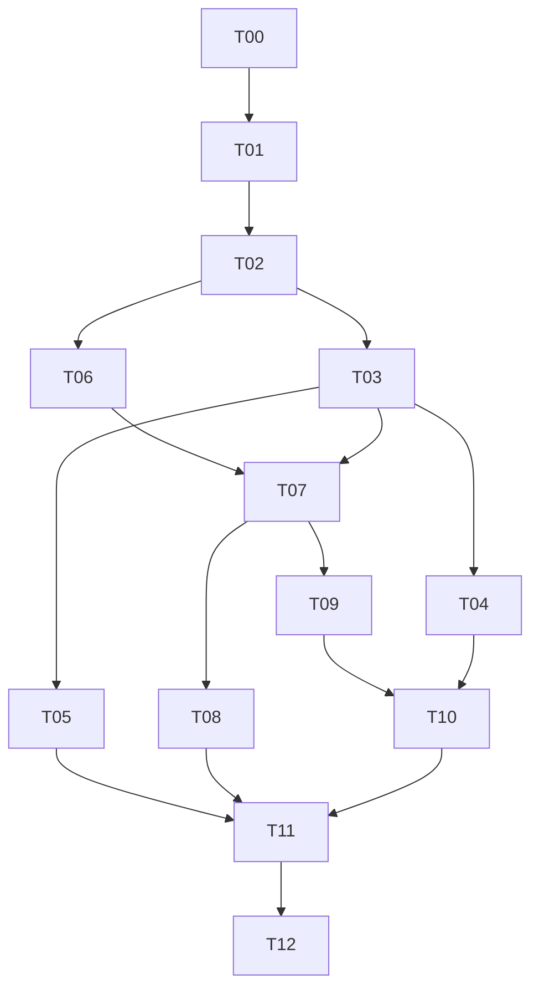

# AISAM — Các task lớn triển khai Permission & Publishing

Ngày lập: **07/09/2026**.

Nguồn: **AISAM_KeHoach_TrienKhai_Permission_Publishing.docx**, phiên bản 1.0, ngày 07/09/2026; đối chiếu sơ bộ với checkout AISAM hiện tại.

Mục đích: theo dõi backlog và tiến độ triển khai. Đã bắt đầu code policy và kiểm thử; chưa áp dụng migration hoặc bật policy mới vào API. Người dùng đã ủy quyền quyết định nghiệp vụ; các quyết định được ghi trong `docs/PERMISSION_PUBLISHING_DECISIONS.md`.

## 1. Phạm vi và kết quả

Hai nhóm nâng cấp chính:

1. **Permission & Access Control:** cách ly dữ liệu theo Brand, phân Team quản lý kênh, bảo mật lịch sử Creator, thống kê hiệu suất thành viên.
2. **Publishing:** nhiều media có thứ tự, snapshot nội dung đăng, Rich Text, validation theo capability từng nền tảng, retry và chống đăng trùng.

Ưu tiên BE/Web trước; mobile theo sau khi contract ổn định. Giữ kiến trúc phân lớp hiện tại, không chuyển sang microservice và không xây permission engine theo từng field.

## 2. Hiện trạng cần tận dụng

| Quan sát từ repository | Hệ quả khi chia task |
|---|---|
| Có Workspace, WorkspaceMember, Team, TeamMember, TeamBrand | Khảo sát mapping/index rồi mở rộng; không tạo mô hình tổ chức song song |
| TeamBrand có TeamId, BrandId, AssignedAt, IsActive | Kiểm tra unique index, thu hồi quyền và tái cấp trước khi thiết kế bảng mới |
| Content đã có BrandId; Post liên kết ContentId | Đối chiếu cách truy ngược workspace/brand trước khi thêm cột dư thừa |
| Asset có UploadedBy, MIME, kích thước, chiều rộng/cao, thời lượng, metadata | Bổ sung phần còn thiếu; không tạo lại toàn bộ metadata media |
| Web đã dùng Tiptap; BE đã có provider và worker | Mở rộng editor/adapter/worker hiện hữu |
| Program.cs hiện dùng ActiveProfileMiddleware và ActiveWorkspaceMiddleware | Bổ sung service kiểm tra resource có chủ đích; không giả định middleware của phiên cũ còn tồn tại |

Đây là khảo sát sơ bộ, không phải kết luận schema hoàn chỉnh. **T00 phải xác nhận entity, DbContext, migrations và dữ liệu thực tế trước khi viết migration.**

## 3. Danh mục task lớn

**Quy tắc cập nhật:** sau khi hoàn thành một hạng mục, đánh dấu `[x]` ngay trong checklist tương ứng. Task lớn chỉ chuyển sang **Hoàn thành** khi đủ phạm vi và tiêu chí nghiệm thu; ghi ngày và bằng chứng kiểm tra. Hoàn thành policy thuần không đồng nghĩa đã hoàn thành resolver/API/runtime.

### Tiến độ tổng hợp — cập nhật 08/09/2026

| Task | Trạng thái | Kết quả / phần còn lại |
|---|---|---|
| T00 | **Hoàn thành — 07/09/2026** | [Contract/ERD/matrix](docs/T00_IMPLEMENTATION_CONTRACT.md), [preflight database](docs/T00_DATABASE_PREFLIGHT.md); kiểm tra chỉ đọc đạt |
| T01 | **Hoàn thành — 08/09/2026** | [Nghiệm thu](docs/T01_COMPLETION.md): schema/grant/attribution/audit/index/trigger; migration đạt trên bản restore dữ liệu thật. Chưa triển khai nguồn |
| T02 | **Hoàn thành — 08/09/2026** | [Nghiệm thu](docs/T02_COMPLETION.md): resolver/DI, 26 test policy và service đạt; PostgreSQL scope smoke đạt. Nối endpoint thuộc T03 |
| T03 | **Hoàn thành — 08/09/2026** | [Nghiệm thu](docs/T03_COMPLETION.md): scope query/API, assignment và audit; 57/57 test tập trung đạt, PostgreSQL restore đạt. Database nguồn chưa migrate |
| T04 | **Hoàn thành — 08/09/2026** | [Nghiệm thu](docs/T04_COMPLETION.md): Brand Access, My content, review queue, quyền thao tác và cache; 81/81 test web và build production đạt |
| T05 | **Hoàn thành — 08/09/2026** | [Nghiệm thu](docs/T05_COMPLETION.md): API/dashboard Member Performance, scope và công thức; 62/62 test BE tập trung, 83/83 test web và build đạt; PostgreSQL restore đạt |
| T06 | **Hoàn thành — 09/09/2026** | [Nghiệm thu](docs/T06_COMPLETION.md): media API, version, snapshot, cleanup; 19/19 test tập trung, PostgreSQL restore và downgrade/reapply đạt; database nguồn chưa migrate |
| T07 | **Hoàn thành phát triển — 09/09/2026; sandbox chưa nghiệm thu** | [Bằng chứng](docs/T07_PROGRESS.md): 54/54 test tập trung, HTTP và PostgreSQL cạnh tranh đạt; chưa bật verified carousel, sandbox là điều kiện phát hành T11 |
| T08 | **Hoàn thành phát triển — 09/09/2026** | [Nghiệm thu](docs/T08_COMPLETION.md): scheduler/journal, snapshot, quyền, retry, khóa automation và nhiều đích; PostgreSQL cạnh tranh/recovery đạt |
| T09–T12 | Chưa thực hiện | Chưa triển khai |

**T00–T06 đã hoàn thành; T07–T08 hoàn thành phần phát triển (9/13 mốc phát triển).** Sandbox/staging chưa nghiệm thu; T09–T12 chưa hoàn thành. Không coi đây là 9 task đã nghiệm thu triển khai thực tế.

**T00–T08 đã hoàn thành phần phát triển**; T09–T12 chưa hoàn thành. Policy đã chốt theo ủy quyền: [decision log](docs/PERMISSION_PUBLISHING_DECISIONS.md). Kết quả khảo sát và thiết kế sơ bộ: [T00_PERMISSION_PUBLISHING_DESIGN.md](docs/T00_PERMISSION_PUBLISHING_DESIGN.md). T00 đã khóa thiết kế/capability fallback và kiểm kê database thật. Thử publish trên tài khoản sandbox thuộc T07/T11, trước khi bật tính năng.

| ID | Task lớn | Đầu mối đề xuất | Phụ thuộc chính | Mốc |
|---|---|---|---|---|
| T00 | Khảo sát và chốt thiết kế nghiệp vụ/API | Tech lead + BE + PO/GVHD | Không | Sprint 0 |
| T01 | Schema phân quyền, attribution và migration | BE/Data | T00 | Sprint 1 |
| T02 | AccessControlService và policy thống nhất | BE | T00, T01 | Sprint 1 |
| T03 | Áp dụng scope toàn hệ thống và API assignment | BE + QA | T02 | Sprint 1 |
| T04 | Permission UX trên Web | FE | Contract T03 ổn định | Sprint 2 |
| T05 | Member Performance API và dashboard | BE + FE | T01–T03 | Sprint 2 |
| T06 | Media collection, upload và snapshot | BE/Data | T00, T02 | Sprint 3 |
| T07 | Capability, provider contract và publish pipeline | BE | T03, T06 | Sprint 3 |
| T08 | Scheduler/automation: quyền, retry, nhất quán | BE | T03, T06, T07 | Sprint 3–4 |
| T09 | Rich Text và formatter theo nền tảng | FE + BE | T00, contract T07 | Sprint 4 |
| T10 | Composer nhiều media và preview | FE | T04, T06, T07, T09 | Sprint 4 |
| T11 | Kiểm thử tổng thể, staging và bàn giao BE/Web | QA + BE + FE | T01–T10 | Cuối Sprint 4 |
| T12 | Mobile tối thiểu theo API mới | Mobile + QA | Contract BE/Web ổn định, T11 | Sau BE/Web |

Các task có thể chia nhỏ và triển khai song song sau khi contract phụ thuộc đã thống nhất. Bảng không có nghĩa phải hoàn tất toàn bộ task trước rồi mới bắt đầu viết test cho task sau.

## 4. Chi tiết task

### T00 — Khảo sát và chốt thiết kế

**Trạng thái: Hoàn thành — 07/09/2026.** Bằng chứng: [contract cuối](docs/T00_IMPLEMENTATION_CONTRACT.md), [decision log](docs/PERMISSION_PUBLISHING_DECISIONS.md), [preflight](docs/T00_DATABASE_PREFLIGHT.md). Công cụ kiểm kê chạy thành công trong giao dịch chỉ đọc; chưa thay đổi database.

**Mục tiêu:** có thiết kế thống nhất trước khi thêm schema và policy.

- [x] Đọc AisamContext, migrations và entity Team/Brand/Social/Content/Asset/Post/PerformanceReport.
- [x] Lập bảng “đã có / mở rộng / cần thêm”, đặc biệt quan hệ Content–Asset và Post–Asset.
- [x] Chốt permission matrix, quy tắc sở hữu nội dung và quyền Manager/Owner.
- [x] Chọn SocialAccount hay SocialIntegration làm định danh kênh cấp quyền.
- [x] Chốt capability/fallback cho các provider dùng demo; khi triển khai phải kiểm chứng tài liệu API chính thức và loại tài khoản thực dùng.
- [x] Chốt policy khi thu hồi quyền, sửa nội dung đã schedule, approval và quyền thực thi worker. Bằng chứng: decision log D04, D07, D08, D10; 07/09/2026.
- [x] Chốt schema/API/error contract, migration/backfill plan và test fixtures.

**Đầu ra:** decision log, permission matrix, ERD thay đổi, capability matrix, API contract, kế hoạch migration và test data.

**Hoàn thành khi:** các quyết định ảnh hưởng bảo mật/dữ liệu ở mục 5 có người xác nhận; câu hỏi chưa chốt được đánh dấu rõ để chặn đúng phần triển khai phụ thuộc.

### T01 — Schema phân quyền và attribution

**Hoàn thành — 08/09/2026:** [Nghiệm thu T01](docs/T01_COMPLETION.md). Lịch sử triển khai: [Báo cáo T01](docs/T01_SCHEMA_RECONCILIATION.md).

- [x] Đối chiếu schema database thực và map Team.WorkspaceId/ProfileId nullable, Content.PrimaryCreatorId/TeamId, TeamBrand và TeamChannelAccess hiện có.
- [x] Tạo migration hòa giải và snapshot; EF xác nhận không còn pending model changes.
- [x] Kiểm tra EF materialization trên database trong transaction chỉ đọc; báo cáo T01_DATABASE_SCHEMA.md.
- [x] Thêm guard SaveChanges/SaveChangesAsync cho Team–Brand–Channel cùng workspace/Brand, membership Creator khi tạo và chống sửa ownership trên entity đã theo dõi; 6 test mới đạt.
- [x] Chạy regression backend sau guard: 437/440 test đạt; 3 lỗi PromptEnhancerTests được ghi trong báo cáo T01, chưa xử lý trong phạm vi này.
- [x] Gán Creator từ JWT cho API tạo/clone Content trong workspace; clone ghi actor mới, không sao chép Creator gốc; 24/24 test ContentService và PermissionIntegrity đạt.
- [x] Gán Creator từ actor phía server cho 5 đường tạo Content trong AIService (draft và các nhánh chat media); chặn actor rỗng ở draft/chat workspace. 39/39 test AIService và PermissionIntegrity đạt.
- [x] Bổ sung CreatedByUserId nullable cho AutomationPlan và migration; nối actor qua tạo/import/clone. Worker dùng actor cho Content/credit và dừng khi Creator không rõ hoặc membership bị thu hồi; 12/12 test automation và integrity đạt. Chưa áp dụng migration lên database.
- [x] Kiểm thử hai migration mới trên PostgreSQL 18 cục bộ riêng: 6 tình huống dữ liệu giả lập và kiểm tra rollback đạt. Chưa thay thế kiểm thử trên bản sao dữ liệu thật/backup-restore.

**Phạm vi:** AISAM.Data, AISAM.Repositories, migrations.

**Nghiệm thu 08/09:** backup public chỉ đọc → restore database riêng → migration SQL/EF history đạt; checksum cột cũ của 6 bảng tài nguyên giữ nguyên; trigger chặn ghi sai scope/Creator/grant. 446/449 test backend đạt, 3 lỗi prompt video hiện hữu ngoài T01. Không thêm BrandMemberAccess theo D05. Audit ở đây là schema/contract; nối audit runtime và scope API thuộc T03. Database nguồn chưa migrate.

- [x] Mở rộng hoặc thêm mapping Team↔Channel với quyền View/Publish/Manage theo định danh đã chốt.
- [x] Chỉ thêm BrandMemberAccess nếu xác nhận cần cấp trực tiếp ngoài Team.
- [x] Bổ sung attribution Creator/Updater/Publisher theo field hiện hữu; phân biệt người tạo với người thực hiện publish.
- [x] Thiết kế audit resource/action/result và thông tin người cấp/thu hồi quyền.
- [x] Unique Team–Brand, Team–Channel; index phục vụ workspace/brand/creator/thời gian.
- [x] Kiểm tra quan hệ cùng workspace khi ghi; không tin ID hoặc attribution client gửi lên.
- [x] Migration theo bước: nullable/bảng mới → backfill có căn cứ → báo cáo dữ liệu không xác định → constraint/index.
- [x] Chuẩn bị backup, rollback và kiểm tra tính toàn vẹn dữ liệu cũ.

**Hoàn thành khi:** migration chạy được trên bản sao dữ liệu; không gán ngẫu nhiên Creator/Brand; không tạo quan hệ chéo workspace; dữ liệu chưa xác định có báo cáo và hướng xử lý.

### T02 — Service tính quyền tập trung

**Hoàn thành — 08/09/2026.** [Báo cáo nghiệm thu T02](docs/T02_COMPLETION.md): IAccessControlService + resolver database và DI; 26/26 test policy/resolver đạt, kiểm tra query trên PostgreSQL restore đạt. Toàn bộ backend 462/465 đạt, ba lỗi prompt video hiện hữu ngoài task. Enforcement toàn endpoint/list và assignment API thuộc T03, chưa được bật chỉ bằng đăng ký DI.

**Phạm vi:** AISAM.Services, permission constants, DI và test policy.

- [x] Viết policy thuần theo role/action/resource facts tại `AISAM.Services/Access/ResourcePermissionPolicy.cs`; 07/09/2026.
- [x] Kiểm thử policy nền tảng: 10/10 test đạt trong `ResourcePermissionPolicyTests`, gồm tenant boundary, Brand scope, Creator/Viewer, quyền publish và Owner billing khi hết hạn; 07/09/2026.

- [x] Xây IAccessControlService với kiểm tra Brand, Channel, Content và truy vấn tập Brand được phép.
- [x] Đánh giá membership → role → brand scope → channel scope → ownership → action.
- [x] Tập trung các permission key trong tài liệu nguồn; bao gồm billing.manage và analytics.member.
- [x] Tách quyền xem lịch sử với quyền sửa/duyệt/publish ở policy thuần; test quyền xem không tự cấp sửa/publish đạt. Áp dụng trên API vẫn thuộc T03.
- [x] Kiểm tra resource thực thuộc workspace; quy định trả 403/404 nhất quán.
- [x] Chốt thiết kế cache: không cache quyền ở giai đoạn đầu (D14). Nếu bổ sung cache sau này phải có key đầy đủ, invalidation và test thu hồi quyền.
- [x] Bảo toàn Owner billing, OAuth và workspace lifecycle; không miễn kiểm tra chỉ vì role cao.

**Hoàn thành khi:** policy có test ma trận role/action/scope; trường hợp thiếu scope bị từ chối; thu hồi quyền có hiệu lực theo thời hạn đã công bố.

### T03 — Scope dữ liệu và quản lý assignment

**Hoàn thành — 08/09/2026.** [Nghiệm thu T03](docs/T03_COMPLETION.md): 57/57 test tập trung đạt; backend 468/471 đạt, ba lỗi prompt video hiện hữu ngoài task. Scope, assignment/audit và migration đã kiểm tra trên PostgreSQL restore riêng; database nguồn chưa migrate. Các giới hạn OAuth, dữ liệu lịch sử và phần worker thuộc T08 được ghi trong báo cáo.

**Phạm vi:** controllers, services, repositories của Brand/Product/Content/Post/Social/Analytics/Ads/Automation/Approval.

- [x] Áp dụng scope ngay trong query database cho list/search/export/count/analytics, trước pagination và aggregate.
- [x] Kiểm tra resource-level access cho detail/edit/delete/publish và deep link.
- [x] Scope cả notification và dữ liệu phụ để tránh lộ tên/nội dung ngoài Brand.
- [x] Creator mặc định chỉ thấy lịch sử của mình trong Brand được cấp; ngoại lệ dùng permission rõ ràng.
- [x] API xem/gán/gỡ Team–Brand và Team–Channel theo contract T00.
- [x] Kiểm tra người gán không thể cấp phạm vi vượt quyền quản lý của mình.
- [x] Audit grant/revoke, approval, publish, delete và social connect/disconnect; không ghi secrets.
- [x] Rà soát cả OAuth callback, scheduled job và automation, không chỉ các màn hình trực tiếp.

**API đề xuất từ nguồn:** `/api/brands/{brandId}/access`, `/api/brands/{brandId}/teams/{teamId}`, `/api/social/accounts/{id}/teams`, `/api/social/accounts/{id}/teams/{teamId}`. T00 điều chỉnh tên nếu resource chính là SocialIntegration.

**Hoàn thành khi:** P01–P04, P06–P08 đạt; list/detail/search/export/aggregate không lộ Brand ngoài scope; gán chéo workspace bị từ chối và không lưu một phần.

### T04 — Permission UX trên Web

**Hoàn thành — 08/09/2026.** [Nghiệm thu T04](docs/T04_COMPLETION.md): 81/81 test web và build production đạt; 43/43 test backend permission/access đạt. Backend đầy đủ 469/472 đạt, ba lỗi PromptEnhancer có từ trước. Đã xử lý scope UI, revision conflict, phản hồi đến muộn và mất quyền; chưa áp dụng migration lên database nguồn hoặc chạy E2E provider thật (T11).

**Phạm vi:** Brand Access, Team, Social, Content, Approvals; services/hooks/stores/contexts.

- [x] UI gán/gỡ Team và quyền kênh, hiển thị quyền hiệu lực.
- [x] Creator có “My content”; filter chỉ chứa Brand/kênh được phép.
- [x] Ẩn/disable action theo quyền nhưng luôn xử lý 403 từ backend.
- [x] Approval queue chỉ hiển thị phạm vi được review.
- [x] Xóa/invalidate cache khi đổi workspace, đổi quyền hoặc mất membership.
- [x] Hiển thị lỗi mất quyền rõ ràng, không loading vô hạn và không tự coi lỗi phân quyền là lỗi đăng nhập.

**Hoàn thành khi:** UI phản ánh quyền từ BE; gọi API trực tiếp vẫn bị chặn khi không có quyền; navigation/cache không hiển thị dữ liệu workspace trước đó.

### T05 — Member Performance

**Hoàn thành — 08/09/2026.** [Nghiệm thu T05](docs/T05_COMPLETION.md): API và dashboard, fixture tính tay đạt; 62/62 test BE tập trung, 83/83 test web, production build và migration/query PostgreSQL trên restore đạt. Database nguồn chưa migrate. KPI lịch lặp/lỗi đăng ngay và dữ liệu legacy thiếu timestamp được ghi rõ là ngoài mẫu tính hiện tại; không suy số liệu giả.

**Phạm vi:** service aggregation, API, dashboard bảng/chart và filter.

- [x] Chốt công thức: content created, approval rate, published posts, on-time rate, engagement, engagement rate, turnaround, failed publish rate.
- [x] Xác định timezone, mốc thời gian cho từng KPI, mẫu số bằng 0 và dữ liệu insights chưa có.
- [x] Tách Creator attribution khỏi Publisher attribution; tránh đếm trùng khi nhiều platform/retry.
- [x] Filter workspace/brand/team/member trước aggregate.
- [x] Owner xem theo policy đã chốt; Manager chỉ phạm vi quản lý; self-performance của Creator theo quyết định sản phẩm.
- [x] API dự kiến `GET /api/team/member-performance` với khoảng thời gian và filter được phép.
- [x] UI giải thích công thức, trạng thái trống/lỗi và thời điểm dữ liệu insights cập nhật.

**Hoàn thành khi:** KPI khớp fixture tính tay; Manager không suy ra số liệu Brand ngoài scope; chuẩn reach/impressions và tolerance đúng lịch được ghi rõ.

### T06 — Media collection, upload và snapshot

**Hoàn thành — 09/09/2026:** [Nghiệm thu và hướng dẫn test API](docs/T06_COMPLETION.md).

**Phạm vi:** entity/mapping/DTO/repository, upload API và storage hiện hữu.

- [x] Mở rộng mapping có sẵn hoặc thêm ContentMedia/PostMedia; thứ tự, cover, alt text/caption.
- [x] Bổ sung metadata Asset còn thiếu; xác định ownership và workspace/brand hợp lệ của asset.
- [x] Upload nhiều file có kết quả từng item; validation MIME/signature, size và quyền ở BE.
- [x] API lưu/reorder danh sách AssetId, không nhận quyền sở hữu do client tự đặt.
- [x] Snapshot cả media và phần nội dung cần publish tại mốc approval/schedule đã chốt.
- [x] Không cho sửa Content làm thay đổi payload đã snapshot.
- [x] Lưu media/provider ID, trạng thái và lỗi từng item; tương thích dữ liệu/client cũ.
- [x] Cleanup orphan asset theo TTL; không xóa asset còn được draft/snapshot tham chiếu.

**Hoàn thành khi:** PUB01, PUB05, PUB08 đạt ở lớp dữ liệu/API; reload giữ thứ tự; asset ngoài scope bị từ chối; snapshot không mất khi draft thay đổi.

### T07 — Capability và publish pipeline

**Hoàn thành phần phát triển — 09/09/2026:** [Nghiệm thu code/test và điều kiện phát hành](docs/T07_PROGRESS.md). Sandbox chưa nghiệm thu; không bật/công bố hỗ trợ thực tế trước khi đạt điều kiện này tại T11.

**Phạm vi:** provider contract/adapter, publish orchestration, response/error model.

- [x] Contract capability cho multi-image, multi-video, mixed media, rich text, count/size/duration. Policy AISAM bảo thủ, duration từ storage/snapshot; xem T07_PROGRESS.md.
- [x] Capability theo platform/account/quyền OAuth; không giả định mọi nền tảng giống nhau.
- [x] Refactor provider hiện có qua upload/publish contract mà không bỏ các flow cũ đang hoạt động.
- [x] Validation khi Publish/Schedule và trước khi worker thực thi. Snapshot/capability được kiểm tra ở service; TikTok đối chiếu duration tài khoản trước init.
- [x] State machine: Queued, UploadingMedia, Publishing, Published, PartiallyPublished, Failed, Cancelled; chốt NeedsAttention ở T00.
- [x] Kết quả độc lập từng platform/media; chỉ mark Published khi đạt điều kiện thành công.
- [x] Lưu idempotency/attempt/provider ID để hỗ trợ T08. Bằng chứng: PublishOperation/PublishRequest, test stub và PostgreSQL restore.
- [x] Chuẩn hóa lỗi capability, media, provider, reconnect; payload/log được sanitize.
- [x] Không tự tách nhiều video thành nhiều post nếu người dùng chưa chọn hành vi đó. Adapter chặn hoặc dùng carousel đã được cho phép.

**Tiêu chí gốc (giữ nguyên điều kiện sandbox trước công bố):** PUB02–PUB05, PUB09–PUB10 đạt với provider stub; có kiểm thử sandbox cho provider demo trước khi công bố hỗ trợ thực tế.

- [ ] Nghiệm thu sandbox trên kênh được chỉ định trước khi bật/công bố hỗ trợ thực tế (theo dõi tiếp ở T11).

### T08 — Scheduler và automation an toàn

**Hoàn thành phần phát triển — 09/09/2026.** [Bằng chứng và điều kiện vận hành](docs/T08_COMPLETION.md): backend 496/499 đạt, ba lỗi PromptEnhancer hiện hữu; PostgreSQL restore xác nhận hai worker, backoff, journal, snapshot và claim bỏ dở. Sandbox/staging thuộc T11.

**Phạm vi:** ScheduledPostingBackgroundService, AutomationGeneration/Operations và service publish dùng chung.

- [x] Re-check workspace, membership, Brand/Channel permission, entitlement và khả dụng social account trước publish.
- [x] Chốt danh tính thực thi: Creator, người schedule, automation owner; không dùng quyền hệ thống để bỏ qua thu hồi quyền.
- [x] Worker chỉ đọc snapshot đã khóa, giữ SortOrder và nội dung đã duyệt.
- [x] Chống hai worker nhận cùng job; idempotency theo lịch + destination và không replay sau timeout/crash; claim bỏ dở cần đối soát.
- [x] Retry lỗi tạm thời đã xác định trước provider; fail/pause lỗi quyền, payload hoặc kết quả chưa rõ theo policy.
- [x] Ghi attempt, error code, provider response ID; notification reconnect/mất quyền/partial failure.
- [x] Plan mất quyền tắt AutoApprove, item NeedsAttention và plan PartiallyFailed theo enum hiện có, không tiếp tục âm thầm.
- [x] Test thay đổi quyền trong thời gian job chờ và sát thời điểm thực thi.

**Hoàn thành khi:** P05, PUB06, PUB08–PUB10 đạt; retry không tạo bài trùng trong kịch bản kiểm thử; thu hồi quyền ngăn bài chưa thực thi được publish.

### T09 — Rich Text và formatter

**Phạm vi:** Tiptap Web, schema/DTO persistence, formatter provider và render preview.

- [ ] Chốt RichTextJson + RichTextVersion là nguồn editor; sinh PlainText nhất quán từ nguồn này.
- [ ] Hỗ trợ bold/italic/underline theo UX, highlight, heading, lists, link, hashtag, undo/redo.
- [ ] Migrate/đọc nội dung plain text cũ mà không làm mất dữ liệu.
- [ ] Allow-list schema/link; sanitize HTML preview nếu sử dụng.
- [ ] Formatter riêng theo provider, character count dựa trên kết quả formatter.
- [ ] Không gửi HTML Tiptap trực tiếp tới API không hỗ trợ.
- [ ] Đưa kết quả format vào snapshot của flow publish theo contract T06/T07.

**Hoàn thành khi:** PUB07 đạt; round-trip editor giữ nội dung hợp lệ; formatter có test cho link/hashtag/list/Unicode và fallback plain text.

### T10 — Composer nhiều media

**Phạm vi:** màn tạo/sửa Content và trải nghiệm Publish/Schedule.

- [ ] Chọn/kéo thả nhiều ảnh/video, reorder, cover/thumbnail khi provider hỗ trợ.
- [ ] Tiến độ upload, lỗi từng file, retry có kiểm soát và khôi phục draft.
- [ ] Preview riêng từng platform bằng formatter/capability từ contract BE.
- [ ] Hiển thị platform không tương thích và cho người dùng bỏ chọn; không âm thầm đổi ý định publish.
- [ ] Ghép Rich Text, media collection, approval và lịch đăng.
- [ ] Theo dõi kết quả từng platform, partial failure và reconnect.

**Hoàn thành khi:** PUB01–PUB05, PUB07–PUB10 có coverage UI phù hợp; người dùng biết file/platform nào lỗi và có thể sửa mà không mất draft.

### T11 — Kiểm thử tổng thể, migration staging và bàn giao

- [ ] Chạy ma trận P01–P08 và PUB01–PUB10, có báo cáo kết quả/liên kết test.
- [ ] Regression auth, OAuth, workspace lifecycle, Owner billing, approval, quota/credit và dữ liệu cũ.
- [ ] Security: IDOR, query leakage, mass assignment, XSS, media giả MIME, grant vượt quyền, webhook signature/idempotency.
- [ ] Kiểm tra query/index/pagination và tải upload/analytics theo dữ liệu mục tiêu; ghi ngưỡng chấp nhận.
- [ ] Seed tối thiểu 2 Brand, 2 Team và ít nhất 4 user; bổ sung đủ Owner/Manager/Viewer/hai Creator cho các kịch bản.
- [ ] Migration trên staging từ backup; đối soát Content/Post/Asset và thực hành rollback.
- [ ] Chạy E2E demo mục 8; dùng sandbox/tài khoản demo có phạm vi được thống nhất.
- [ ] Cập nhật Swagger, ERD, permission/capability matrix, Rich Text schema, runbook và release notes.

**Hoàn thành khi:** critical tests đạt, không còn lỗi rò dữ liệu đã biết trong phạm vi kiểm thử; migration/rollback có bằng chứng; release có commit và danh sách giới hạn rõ ràng. Triển khai production là bước riêng sau khi có bản staging để đánh giá.

### T12 — Mobile tối thiểu

- [ ] Đồng bộ DTO, error handling và scope với API mới.
- [ ] Danh sách/chi tiết Content theo quyền; deep link không lộ nội dung.
- [ ] Tạo nội dung nhiều media, giữ thứ tự và xem publish status.
- [ ] Approval và self-performance theo phạm vi sản phẩm đã chốt.
- [ ] Render Rich Text/PlainText tương thích schema; không bắt buộc editor ngang bằng Web ngay đợt đầu.
- [ ] Test auth/workspace/content/approval trên client cũ và mới theo compatibility plan.

**Hoàn thành khi:** subset đã chốt dùng được với API mới, đúng scope; ghi rõ các chức năng chỉ có trên Web.

## 5. Quyết định cần chốt tại T00

Các giá trị dưới đây là **khuyến nghị của tài liệu nguồn hoặc đề xuất cần xác nhận**, chưa phải quyết định đã duyệt.

| ID | Câu hỏi | Hướng đề xuất | Chặn phần nào nếu chưa chốt |
|---|---|---|---|
| D01 | Owner có xem mọi Brand? | Có trong workspace của mình, cần business xác nhận | T02–T05 |
| D02 | Manager có xem mọi Brand? | Chỉ Brand được gán | T02–T05 |
| D03 | Creator xem nội dung đồng đội? | Không mặc định; dùng content.view_all_creators | T02–T05 |
| D04 | Approver là role riêng? Viewer xem lịch sử ai? | Approver dùng approval.review; Viewer cần policy riêng | T02–T04 |
| D05 | Cấp trực tiếp user ngoài Team? | Chỉ thêm override nếu cần thật | T01–T04 |
| D06 | Resource kênh là Account hay Integration? | Chọn theo mapping/API thật, không trộn định danh | T01–T03, T07 |
| D07 | Thu hồi quyền khi đang scheduled? | Pause/fail và notification; tiếp quản phải có quyền và audit | T03, T08 |
| D08 | Ai là chủ thể quyền của worker? | Ghi rõ người schedule/automation owner và thời điểm re-check | T07–T08 |
| D09 | Provider không hỗ trợ nhiều video/mixed media? | Chặn, báo rõ; không tự tách post | T07, T10 |
| D10 | Sửa Content sau schedule? | Không đổi snapshot; đổi lịch/payload cần quy trình rõ | T06–T10 |
| D11 | KPI dùng reach hay impressions? | Chuẩn theo platform; chốt tolerance on-time và timezone | T01, T05 |
| D12 | 403 hay 404 khi truy cập ID ngoài scope? | Chọn convention thống nhất | T02–T04 |
| D13 | NeedsAttention/Paused và partial success biểu diễn thế nào? | Chốt state machine và chuyển trạng thái hợp lệ | T06–T10 |
| D14 | Cache quyền chấp nhận trễ bao lâu? | TTL công bố và invalidation khi grant/revoke | T02–T04, T08 |

## 6. Thứ tự và thời lượng tham chiếu

| Sprint | Phạm vi | Thời lượng trong bản nguồn | Điều kiện chuyển mốc |
|---|---|---|---|
| 0 | T00 | 2–3 ngày | Thiết kế và quyết định được xác nhận |
| 1 | T01–T03 | 4–6 ngày | Brand isolation và regression billing đạt |
| 2 | T04–T05 | 4–6 ngày | Permission UX và KPI đúng scope |
| 3 | T06–T08 phần nền tảng | 4–6 ngày | Media/snapshot/capability và worker core đạt |
| 4 | T08 hoàn thiện, T09–T11 | 4–6 ngày | E2E, security và staging đạt |
| Sau BE/Web | T12 | Chưa ước lượng | Contract ổn định |

Tổng tham chiếu BE/Web: **18–27 ngày** nếu cộng tuần tự các sprint trong nguồn. Đây không phải cam kết thời hạn hay số ngày công; cần ước lượng lại sau T00 theo nhân sự, dữ liệu cũ và khả năng kiểm thử provider. T11 được chuẩn bị xuyên suốt, không đợi cuối sprint mới viết test.

## 7. Ma trận nghiệm thu truy vết theo tài liệu nguồn

| Test | Nội dung | Task chịu trách nhiệm |
|---|---|---|
| P01 | Creator list đúng Brand và ownership | T02, T03, T04 |
| P02 | Đoán ID Brand khác bị từ chối | T02, T03 |
| P03 | Manager không xem analytics Brand ngoài scope | T03, T05 |
| P04 | Không gán Team chéo workspace | T01, T03 |
| P05 | Thu hồi Channel Publish ngăn scheduled job | T02, T08 |
| P06 | Viewer gọi publish trực tiếp bị chặn | T02, T03, T07 |
| P07 | Search/export giữ scope Creator | T03 |
| P08 | Owner billing không bị hồi quy | T02, T03, T11 |
| PUB01 | 5 ảnh reorder/save/reload đúng thứ tự | T06, T10 |
| PUB02 | Nhiều video trên provider hỗ trợ | T07, T10 |
| PUB03 | Provider không hỗ trợ nhiều video bị chặn trước gọi publish | T07, T10 |
| PUB04 | Mixed media không hỗ trợ có lỗi rõ | T07, T10 |
| PUB05 | Một media lỗi không mark Published sai | T06, T07, T10 |
| PUB06 | Retry timeout không tạo bài trùng | T07, T08 |
| PUB07 | Rich Text nguy hiểm không thực thi script | T09, T10 |
| PUB08 | Sửa draft không đổi snapshot scheduled | T06, T08, T09 |
| PUB09 | OAuth hết hạn có lỗi/reconnect notification | T07, T08 |
| PUB10 | Multi-platform có trạng thái độc lập | T07, T08, T10 |

T11 chạy tổng hợp toàn bộ ma trận. Các bài test phải bao gồm gọi API trực tiếp; kiểm tra nút ẩn trên giao diện là chưa đủ.

## 8. Kịch bản demo cuối cùng

1. Owner tạo Brand A/B và Team Alpha/Beta, gán kênh tương ứng.
2. Creator A thuộc Alpha chỉ thấy Brand A, kênh được cấp và nội dung của mình.
3. Creator A soạn Rich Text, tải nhiều media hợp lệ, reorder và gửi duyệt.
4. Manager A duyệt và schedule trên kênh A trong phạm vi được quản lý.
5. Worker kiểm tra lại quyền, publish snapshot và ghi trạng thái từng platform/media.
6. Creator B truy cập URL Content A bị từ chối, không thấy metadata nhạy cảm.
7. Manager A xem KPI thuộc Alpha/Brand A, không có số liệu Brand B.
8. Owner thu hồi quyền publish của Alpha; job tiếp theo bị dừng theo policy và có notification.
9. Owner vẫn có thể thực hiện flow nâng cấp/gia hạn theo chính sách billing, kể cả kịch bản workspace hết hạn được hỗ trợ.

## 9. Checklist sẵn sàng bắt đầu và bàn giao

### Trước khi code phần phụ thuộc thiết kế

- [ ] T00 có người phụ trách và baseline commit.
- [ ] Permission matrix được PO/GVHD xác nhận theo quy trình trong tài liệu nguồn.
- [ ] Quyết định D01–D14 có trạng thái và người chốt.
- [ ] API/schema/error contract đủ để chia BE/FE.
- [ ] Có test fixtures đa Brand/Team/role và database staging.

### Trước khi bàn giao BE/Web

- [ ] P01–P08, PUB01–PUB10 và regression critical flow đạt.
- [ ] Có bằng chứng scope trước aggregate/export và hiệu lực thu hồi quyền.
- [ ] Provider capability demo được kiểm chứng; phần chưa hỗ trợ được ghi rõ.
- [ ] Migration/backfill/rollback không làm mất Content/Post/Asset.
- [ ] Swagger, ERD, Rich Text schema/version, runbook và demo scope cập nhật.
- [ ] Ghi phiên bản code/database đã kiểm thử và các vấn đề còn mở.

## 10. Ngoài phạm vi đợt đầu

- Permission engine ACL từng field, hoặc quá nhiều role mới theo từng Brand.
- Tách backend thành microservice.
- Giả lập cùng capability cho mọi social platform.
- Tự chuyển một yêu cầu nhiều video thành nhiều post mà không có lựa chọn rõ ràng.
- Mobile/admin parity trước khi core BE/Web và security test ổn định.

**Task phát triển tiếp theo: T09 — Rich Text và formatter.** T07–T08 hoàn thành code/test; sandbox/staging vẫn là điều kiện phát hành bắt buộc ở T11.
