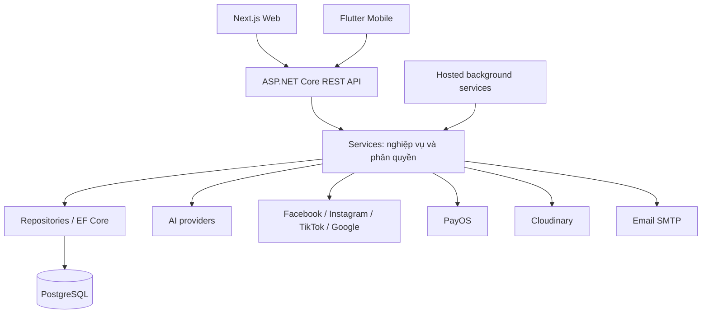
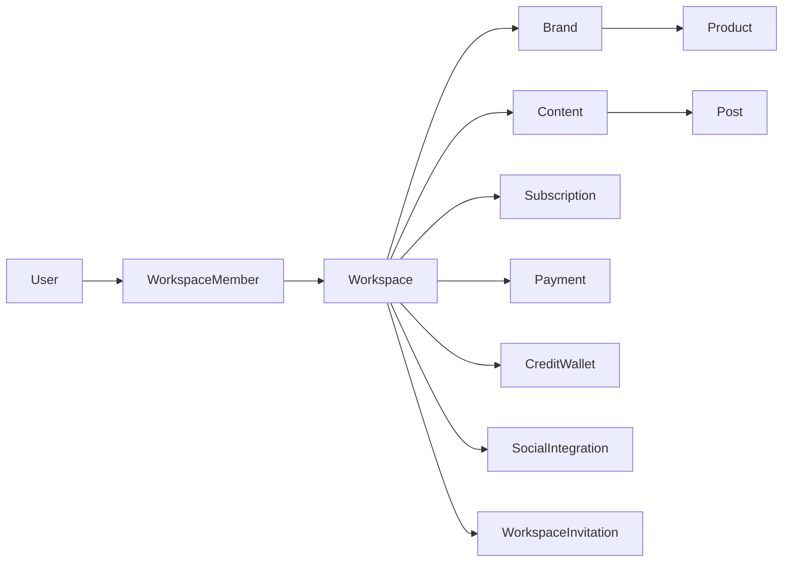

# Mô tả dự án AISAM

Ngày khảo sát: **07/09/2026**. Tài liệu mô tả mã nguồn hiện có trong repository, dành cho người tiếp nhận dự án, phát triển và chuẩn bị báo cáo đồ án. Các chức năng được liệt kê theo mã nguồn, không đồng nghĩa mọi tích hợp đã được kiểm thử thành công trên môi trường triển khai. Tài liệu không chứa giá trị API key, mật khẩu hoặc token.

## 1. Tổng quan

**AISAM — AI-powered Social Media Advertising Platform** là nền tảng hỗ trợ quản lý nội dung mạng xã hội và quảng cáo cho cá nhân, doanh nghiệp nhỏ và vừa. Hệ thống kết hợp quản lý thương hiệu, tạo nội dung bằng AI, duyệt nội dung, lên lịch đăng, kết nối tài khoản mạng xã hội, theo dõi hiệu quả và thanh toán gói dịch vụ.

Dự án gồm ba ứng dụng:

| Thành phần | Vai trò |
|---|---|
| AISAM-BE | REST API, nghiệp vụ, phân quyền, dữ liệu, tác vụ nền và tích hợp dịch vụ |
| AISAM-FE | Website và dashboard cho người dùng, workspace và quản trị viên |
| AISAM-MB | Ứng dụng Flutter truy cập nghiệp vụ qua API |

Đơn vị tổ chức nghiệp vụ quan trọng là **workspace**. Người dùng tham gia workspace thông qua membership; thương hiệu, nội dung, subscription, thanh toán và credit được gắn với workspace. Mã nguồn vẫn có **profile**, vì vậy không nên coi profile và workspace là cùng một thực thể.

## 2. Kiến trúc hệ thống



Backend là ứng dụng phân lớp chạy chung một tiến trình, không phải tập hợp microservice. Các tác vụ định kỳ được đăng ký bằng hosted service trong API. Vì vậy việc dừng API cũng ảnh hưởng các tác vụ nền thuộc tiến trình đó.

### 2.1 Cấu trúc thư mục

```text
AISAM-FINAL/
├── AISAM-BE/
│   ├── AISAM.API/             # Controllers, middleware, cấu hình khởi động
│   ├── AISAM.Services/        # Nghiệp vụ, provider, tác vụ nền
│   ├── AISAM.Repositories/    # DbContext, repositories, migrations
│   ├── AISAM.Data/            # Entity và enum
│   ├── AISAM.Common/          # DTO, cấu hình và kiểu phản hồi dùng chung
│   ├── tests/                # Kiểm thử backend
│   ├── AISAM.sln
│   └── docker-compose.yml
├── AISAM-FE/
│   ├── src/app/              # Routes Next.js App Router
│   ├── src/components/       # Thành phần giao diện
│   ├── src/services/         # Lời gọi API theo nghiệp vụ
│   ├── src/lib/              # API client, auth và tiện ích
│   ├── src/hooks/            # Logic dùng lại và tải dữ liệu
│   ├── src/contexts/         # React contexts
│   ├── src/stores/           # Trạng thái workspace/profile
│   └── e2e/                  # Playwright
├── AISAM-MB/
│   ├── lib/app/              # Cấu hình ứng dụng và router
│   ├── lib/core/             # Hạ tầng, cấu hình
│   ├── lib/features/         # Module nghiệp vụ
│   ├── lib/shared/           # Thành phần dùng chung
│   └── test/
├── .github/workflows/        # Workflow triển khai
├── deploy/nginx/            # Cấu hình Nginx bổ sung
├── docs/                    # Tài liệu hiện có
├── test-cases/              # Tài nguyên kiểm thử
├── unit-tests/              # Tài nguyên kiểm thử bổ sung
└── scratch/                 # Công cụ/thử nghiệm cục bộ, không phải ứng dụng chính
```

Các thư mục `.artifacts`, `.buildcheck`, `bin`, `obj`, `.next` là đầu ra hoặc khu vực phục vụ build/kiểm tra, không phải các module nghiệp vụ.

## 3. Công nghệ

| Lớp | Công nghệ khai báo trong dự án |
|---|---|
| Backend runtime | C#, ASP.NET Core, target `net8.0` |
| Truy cập dữ liệu | Entity Framework Core, Npgsql PostgreSQL provider 9.0.4 |
| Công cụ EF | Microsoft.EntityFrameworkCore.Tools 9.0.9 |
| Xác thực | JWT Bearer, đăng nhập Google, session và refresh token |
| Cấu hình BE | appsettings, biến môi trường, DotNetEnv 3.1.1 |
| API docs | Swagger / Swashbuckle 6.6.2 |
| Web | Next.js 16.2.7, React 19.2.4, TypeScript |
| Giao diện | Tailwind CSS 4, Motion, Recharts, Tiptap |
| Kiểm thử web | Vitest, Testing Library, Playwright |
| Mobile | Flutter; ràng buộc Dart SDK `^3.10.4` |
| Mobile state/network | Riverpod, Dio, Retrofit, GoRouter |
| Mobile lưu trữ | flutter_secure_storage, shared_preferences |
| Database phát triển | Docker Compose khai báo PostgreSQL 16 Alpine |
| Triển khai | GitHub Actions, SSH tới VPS; tài nguyên Nginx |

**Lưu ý:** README gốc ghi .NET 9, nhưng `AISAM.API.csproj` hiện target **.NET 8**. Phiên bản package EF 9 không có nghĩa ứng dụng target .NET 9. Phiên bản phụ thuộc web/mobile có ký hiệu `^` là ràng buộc trong manifest, không phải khẳng định phiên bản đang cài chính xác.

## 4. Người dùng và phân quyền

Hệ thống phân biệt vai trò người dùng toàn hệ thống với vai trò trong workspace. Một người có thể có quyền khác nhau ở các workspace khác nhau.

| Vai trò workspace | Giá trị enum | Ý nghĩa nghiệp vụ |
|---|---:|---|
| Owner | 1 | Quản lý workspace, chịu trách nhiệm billing |
| Manager | 2 | Quản lý vận hành nội dung và các chức năng được cho phép |
| ContentCreator | 3 | Tạo/chỉnh sửa nội dung và các thao tác sáng tạo được cho phép |
| Viewer | 4 | Xem dữ liệu trong phạm vi cho phép |

Quyền cụ thể cần kiểm tra trong `ActiveWorkspaceMiddleware`, controller và service tương ứng. Không thể suy ra quyền chỉ từ việc giao diện hiện một nút.

`X-Workspace-Id` và `X-Profile-Id` truyền ngữ cảnh làm việc. Đây là ngữ cảnh để backend kiểm tra, không thay thế JWT và không tự cấp quyền sở hữu.

Pipeline hiện tại trong `Program.cs` gồm xử lý lỗi, maintenance mode, rate limiter, authentication, `ActiveProfileMiddleware`, `ActiveWorkspaceMiddleware`, authorization và controller. **Không có `ResourceAccessMiddleware` được đăng ký trong bản mã nguồn đang khảo sát.** Do đó không dùng mô tả hoặc bản sửa ở phiên làm việc cũ để suy luận pipeline hiện tại.

## 5. Các nhóm chức năng

### 5.1 Tài khoản và xác thực

- Đăng ký, đăng nhập bằng email/mật khẩu và Google.
- Xác minh email, gửi lại email xác minh, quên và đặt lại mật khẩu.
- Lấy thông tin người dùng hiện tại, refresh token và đăng xuất.
- Quản lý session; frontend có tiện ích lưu token và thông tin người dùng.

Luồng Google: trình duyệt nhận credential từ Google Identity Services → gửi ID token đến `/api/auth/google` → BE xác minh token với Google Client ID được cấu hình → xử lý tài khoản → phát token của AISAM. Google ID token và access token của AISAM có mục đích khác nhau.

### 5.2 Workspace, profile và thành viên

- Workspace cá nhân và doanh nghiệp; lựa chọn workspace đang hoạt động.
- Quản lý thông tin workspace, membership và lời mời.
- Profile có module riêng trên web, mobile và backend.
- Entity `Team`, `TeamMember`, `TeamBrand` hiện diện trong mô hình dữ liệu; sự tồn tại entity không tự chứng minh có đủ API CRUD độc lập cho từng entity.
- Kiểm tra giới hạn thành viên và trạng thái workspace theo nghiệp vụ.

### 5.3 Brand Kit và sản phẩm

- Quản lý thương hiệu, mô tả, nhận diện và thông tin phục vụ tạo nội dung.
- Quản lý sản phẩm; có service nhập thông tin sản phẩm.
- Liên kết dữ liệu thương hiệu với nội dung và kênh mạng xã hội.
- Có module Business KYC và tra cứu thông tin doanh nghiệp.

### 5.4 Nội dung, duyệt và xuất bản

- Tạo, chỉnh sửa, liệt kê và xem chi tiết nội dung.
- Gắn tài nguyên ảnh/video, sử dụng trình soạn thảo trên web.
- Có màn hình approvals và entity `Approval` cho quy trình duyệt.
- Quản lý bài đăng và lịch nội dung; đăng ngay hoặc lên lịch theo API tương ứng.
- Phân biệt nội dung soạn thảo (`Content`), kết quả/bản ghi đăng (`Post`) và lịch (`ContentCalendar`).

### 5.5 AI văn bản, ảnh, video và hội thoại

- Tạo nội dung văn bản từ prompt và dữ liệu nghiệp vụ.
- Tạo ảnh và video qua các provider được đăng ký.
- Hội thoại và lịch sử tin nhắn qua `Conversation`, `ChatMessage`.
- Ghi nhận lượt tạo AI qua `AiGeneration`; liên quan quota/credit.
- Có cơ chế provider dự phòng; cấu hình và lỗi provider ảnh hưởng kết quả thực tế.
- Video có job riêng và polling; `AIVideoProviderFactory` trả provider rỗng khi video bị tắt trong cấu hình.

Các client/provider trong mã nguồn gồm Gemini, OpenRouter, OpenAI, Hugging Face, DeAPI và Colab. Không nên suy luận tất cả đều đang được bật hoặc có tài khoản khả dụng chỉ từ tên class.

### 5.6 Automation và lịch đăng

- Quản lý automation plan và item.
- Tự động tạo nội dung, xử lý vận hành automation và đăng bài theo lịch.
- Có các worker riêng cho video và đồng bộ insights.
- Cần API và database hoạt động ổn định để tác vụ nền thực thi.

### 5.7 Kết nối mạng xã hội và quảng cáo

- Provider cho Facebook, Instagram, TikTok và Google được đăng ký trong backend.
- Có controller cho social auth, account, integration và OAuth relay.
- Quản lý chiến dịch quảng cáo, ad set, ad, creative qua các entity tương ứng.
- Có tracking và đồng bộ hiệu quả bài đăng/chiến dịch.
- Quyền OAuth, khả năng API của từng nền tảng và cấu hình tài khoản là điều kiện riêng; không phải mọi provider đều hỗ trợ giống nhau.

### 5.8 Analytics và dashboard

- Dashboard người dùng, dashboard workspace và trang analytics.
- Lưu dữ liệu hiệu quả bằng `PerformanceReport`, `CampaignInsightSnapshot`.
- Các worker cập nhật insights bài đăng và chiến dịch.
- Có chức năng AI liên quan phân tích; tài liệu kiểm tra bổ sung nằm trong `docs/analytics-ask-ai-fix-validation-report.md`.

### 5.9 Subscription, PayOS, quota và credit

- Bảng giá, nâng cấp subscription, mua credit và xem lịch sử sử dụng.
- `IPaymentService` được đăng ký với `PayOSPaymentService` trong DI hiện tại.
- Checkout thường, checkout tạo workspace doanh nghiệp, callback/webhook và đồng bộ trạng thái thanh toán.
- Subscription thể hiện gói sử dụng; credit wallet và usage records thể hiện số dư/tiêu hao; không phải cùng một loại dữ liệu.
- Trạng thái thanh toán phải được xử lý qua BE, không chỉ dựa vào việc trình duyệt quay lại trang thành công.
- Middleware hiện tại dành quyền quản lý billing cho Owner; nhánh payment được xét trước quy tắc workspace chỉ đọc.
- Giá gói không ghi cố định trong tài liệu này: hệ thống có module quản trị plan và cấu hình, cần lấy giá thực tế từ API/database.

### 5.10 Quản trị hệ thống

Nhóm `/admin` có màn hình và controller cho dashboard, người dùng, workspace, nội dung, thanh toán, plan, credit, analytics, ngày lễ, thông báo broadcast, audit log, health, cấu hình email, AI provider và hệ thống.

Các controller quản trị không đồng nghĩa mọi người dùng có thể truy cập. Quyền được quyết định bởi xác thực và kiểm tra trong backend.

## 6. Dữ liệu và quan hệ chính

| Nhóm | Entity tiêu biểu | Vai trò |
|---|---|---|
| Danh tính | User, Session, Profile | Tài khoản, phiên đăng nhập và profile |
| Tổ chức | Workspace, WorkspaceMember, WorkspaceInvitation | Không gian làm việc, vai trò, mời thành viên |
| Nhóm | Team, TeamMember, TeamBrand | Liên kết nhóm, thành viên và thương hiệu |
| Thương hiệu | Brand, Product | Dữ liệu sản phẩm và thương hiệu |
| Nội dung | Content, ContentTemplate, Asset, Approval | Soạn thảo, media và duyệt |
| Xuất bản | Post, ContentCalendar | Bài đăng và lịch |
| Mạng xã hội | SocialAccount, SocialIntegration | Tài khoản/kênh tích hợp |
| AI | AiGeneration, VideoGenerationJob, Conversation, ChatMessage | Lượt tạo, job và hội thoại |
| Tự động hóa | AutomationPlan, AutomationItem | Kế hoạch và từng mục thực thi |
| Quảng cáo | AdCampaign, AdSet, Ad, AdCreative | Cấu trúc chiến dịch |
| Đo lường | PerformanceReport, CampaignInsightSnapshot | Hiệu quả và dữ liệu chụp theo thời điểm |
| Tài chính | Subscription, Payment, CreditWallet, CreditUsageRecord | Gói, giao dịch, credit |
| Hệ thống | Notification, AuditLog, SystemSetting, HolidayEvent | Thông báo, log, cấu hình, ngày lễ |



Sơ đồ thể hiện quan hệ nghiệp vụ chính, không phải ERD đầy đủ về khóa ngoại và cardinality. Cấu trúc database chính xác cần đọc `AISAM.Repositories/AisamContext.cs`, entity và migrations; database đang chạy có thể chưa áp dụng toàn bộ migration.

### 6.1 Vòng đời workspace doanh nghiệp

Theo `WorkspaceLifecyclePolicy`, nếu có thời điểm hết hạn subscription:

| Thời gian tính từ hết hạn | Trạng thái được suy ra |
|---|---|
| Chưa hết hạn | Active |
| Đã hết hạn, dưới 90 ngày | Limited |
| Từ 90 đến hết 180 ngày | Archived |
| Trên 180 ngày | EligibleForDeletion |

Limited, Archived và EligibleForDeletion là trạng thái chỉ đọc theo policy. Deleted không được đồng bộ trở lại Active bởi hàm này. EligibleForDeletion chỉ là trạng thái đủ điều kiện, không tự chứng minh dữ liệu đã bị xóa.

## 7. Tác vụ nền

Các hosted service đang đăng ký trong API:

| Worker | Trách nhiệm theo module |
|---|---|
| ScheduledPostingBackgroundService | Xử lý bài đăng đã lên lịch |
| AutomationGenerationBackgroundService | Sinh nội dung automation |
| AutomationOperationsBackgroundService | Xử lý vận hành automation |
| VideoPollingBackgroundService | Theo dõi trạng thái video |
| VideoGenerationBackgroundService | Xử lý tạo video |
| CampaignInsightsBackgroundService | Đồng bộ hiệu quả chiến dịch |
| PostInsightsBackgroundService | Đồng bộ hiệu quả bài đăng |

Khi triển khai nhiều tiến trình API, cần kiểm tra cơ chế nhận job và chống xử lý trùng trong từng service trước khi tăng số instance. Tài liệu này chưa xác nhận khả năng chạy phân tán của toàn bộ worker.

## 8. Frontend web

Web dùng Next.js App Router. Route group `(auth)`, `(dashboard)`, `(admin)` tổ chức layout, không xuất hiện trực tiếp trong URL.

Các điểm vào quan trọng:

- `src/lib/apiClient.ts`: tạo request, thêm header, xử lý phản hồi và refresh.
- `src/lib/auth.ts`: token, refresh token và thông tin người dùng.
- `src/lib/googleIdentity.ts`: nạp và khởi tạo Google Identity Services.
- `src/hooks/useWorkspaces.ts`: tải và chọn workspace, cache liên quan.
- `src/stores/`: ngữ cảnh workspace/profile đang chọn.
- `src/services/paymentService.ts`: gọi API thanh toán.
- `src/contexts/FeatureFlagsContext.tsx`: tải và cung cấp feature flags.

Route web đầy đủ tại thời điểm khảo sát được liệt kê trong phụ lục bên dưới. Việc có page không bảo đảm tất cả nhánh tương tác trong page đã hoàn thiện.

## 9. Mobile

Các module trong `AISAM-MB/lib/features`: approval, auth, billing, calendar, chat, content, dashboard, notifications, profile, settings và workspace.

`lib/app/router.dart` quản lý điều hướng. `lib/core/config/env_config.dart` đọc `API_BASE_URL`, `CONNECT_TIMEOUT_MS`, `RECEIVE_TIMEOUT_MS`; giá trị API mặc định là `http://localhost:5027/api`.

Ứng dụng mobile có thư mục test cho auth, content, profile và workspace. Phạm vi mobile không được giả định ngang bằng toàn bộ dashboard web, đặc biệt các màn quản trị và quảng cáo.

## 10. Cấu hình môi trường

| Thành phần | Nguồn cấu hình |
|---|---|
| Backend | `AISAM-BE/AISAM.API/.env`, appsettings và biến môi trường |
| Frontend | `AISAM-FE/.env.local` |
| Mobile | `AISAM-MB/.env`, được khai báo trong assets Flutter |

Các nhóm biến backend: kết nối database; JWT; URL frontend/CORS; Google; SMTP; Facebook/Instagram/TikTok; AI text/image/video; PayOS; Cloudinary; Data Protection; giới hạn pool database. Phụ lục chỉ liệt kê tên biến đọc từ mã nguồn, không sao chép nội dung `.env`.

Web cần `NEXT_PUBLIC_API_URL` và `NEXT_PUBLIC_GOOGLE_CLIENT_ID` cho các luồng tương ứng. Biến `NEXT_PUBLIC_*` được đưa ra phía trình duyệt, không dùng để lưu client secret. Google Client ID của FE phải phù hợp Client ID BE dùng xác minh token.

API đọc `.env` theo content root trong `Program.cs`. File cần đúng cú pháp `KEY=VALUE`; dấu nháy hoặc dòng cấu hình bị tách sai có thể làm API dừng trước khi mở cổng. Thay đổi cấu hình BE cần khởi động lại tiến trình; thay đổi biến public FE cần nạp lại môi trường build/dev.

## 11. Chạy dự án cục bộ

### 11.1 Backend

Từ thư mục gốc repository:

```powershell
cd AISAM-BE
dotnet restore .\AISAM.API\AISAM.API.csproj
dotnet run --project .\AISAM.API\AISAM.API.csproj --launch-profile http
```

Profile HTTP bind `0.0.0.0:5027`; mở bằng `http://localhost:5027/swagger`. Profile HTTPS còn khai báo cổng 7192. Swagger hiện chỉ bật trong Development.

Trên máy đang dùng trong phiên làm việc, SDK đã được tìm thấy ở `C:\Users\thanh\.dotnet`. Nếu `dotnet` mặc định báo không có SDK:

```powershell
cd C:\DATN-2026\AISAM-FINAL\AISAM-BE
$env:DOTNET_ROOT = 'C:\Users\thanh\.dotnet'
& 'C:\Users\thanh\.dotnet\dotnet.exe' run --project .\AISAM.API\AISAM.API.csproj --launch-profile http
```

Đây là đường dẫn riêng của máy hiện tại, không phải điều kiện bắt buộc trên máy khác.

### 11.2 Database

`AISAM-BE/docker-compose.yml` chỉ khai báo PostgreSQL, không tự chạy API hoặc frontend:

```powershell
cd AISAM-BE
docker compose up -d db
```

Cần cấu hình `CONNECTION_STRING` trỏ đúng database. Nếu dùng PostgreSQL/Supabase bên ngoài thì không bắt buộc chạy container này. Việc tạo container không tự bảo đảm schema đã cập nhật.

Lệnh quản lý migration, chạy từ `AISAM-BE` khi công cụ dotnet-ef đã sẵn sàng:

```powershell
dotnet ef migrations list --project AISAM.Repositories --startup-project AISAM.API
# Chỉ áp dụng lên database đã chọn và có chủ đích:
dotnet ef database update --project AISAM.Repositories --startup-project AISAM.API
```

### 11.3 Frontend

Trong terminal khác, từ gốc repository:

```powershell
cd AISAM-FE
npm install
npm run dev
```

Mở `http://localhost:3000`. Giá trị API frontend phải trỏ tới API đang chạy, thông thường `http://localhost:5027/api`.

### 11.4 Mobile

```powershell
cd AISAM-MB
flutter pub get
flutter run
```

Đặt `API_BASE_URL` phù hợp thiết bị. Trên điện thoại, localhost là điện thoại chứ không phải máy chạy BE; cần địa chỉ mạng có thể truy cập tới máy chạy API. Tài liệu này không kiểm chứng cấu hình emulator/thiết bị cụ thể.

## 12. Kiểm thử

```powershell
# Từ gốc repository: backend
dotnet test AISAM-BE/tests/AISAM.IntegrationTests/AISAM.IntegrationTests.csproj

# Trong AISAM-FE
npm test -- --run
npm run test:e2e
npm run build

# Trong AISAM-MB
flutter test
```

Backend có test controller, repository, service, middleware, workspace, social provider, payment, quota, nội dung, AI và lịch đăng. Web có unit/component tests trong `__tests__` và E2E cho auth, content, access/navigation. Xem `AISAM-FE/e2e/README.md` để chuẩn bị môi trường E2E.

Trong lần tạo tài liệu này không chạy lại toàn bộ test hoặc giao dịch bên ngoài. Kết quả test của phiên sửa lỗi cũ không được coi là chứng nhận cho mã nguồn hiện tại.

## 13. Triển khai và vận hành

Workflow `.github/workflows/deploy-aisam.yml` được kích hoạt khi push vào main/master và thay đổi các đường dẫn được lọc. Workflow dùng GitHub secrets cho SSH tới VPS, sau đó gọi `deploy-aisam.sh` trong thư mục ứng dụng trên máy chủ.

**Điểm cần đối chiếu:** workflow tham chiếu `deploy-aisam.sh`, nhưng không thấy file này tại gốc checkout lúc khảo sát. Vì vậy chưa thể mô tả đầy đủ các bước build/restart trên VPS chỉ từ workflow hiện có.

`deploy/nginx/` có cấu hình tăng giới hạn upload và README hướng dẫn. Không coi đây là toàn bộ cấu hình production. API có health/admin health controller để phục vụ kiểm tra vận hành.

## 14. Các lỗi thường gặp trong quá trình chạy

| Hiện tượng | Ý nghĩa/cách khoanh vùng |
|---|---|
| No .NET SDKs were found | Shell đang gọi runtime không có SDK hoặc sai PATH |
| MSB1009 Project file does not exist | Đường dẫn project không đúng với thư mục terminal hiện tại |
| DotNetEnv/Sprache ParseException | Cú pháp `.env` lỗi, thường do dấu nháy hoặc dòng thừa |
| Database tenant/user not found | Đối chiếu host, user, project và trạng thái dịch vụ database |
| Google untrusted aud | Token Google không thuộc Client ID BE chấp nhận |
| Google origin not allowed | Đối chiếu origin trình duyệt với cấu hình OAuth client thực dùng |
| 401 từ API | Thiếu/không chấp nhận thông tin xác thực; đọc Response và log BE |
| 403 từ API | Đã bị kiểm tra quyền/ngữ cảnh/chính sách; kiểm tra mã lỗi cụ thể |
| 500 từ API | Lỗi phía server; cần exception/log để xác định, không kết luận chỉ từ status |
| Checkout bị chặn | Kiểm tra membership Owner của workspace đang chọn, trạng thái và nhánh authorization hiện tại |

Các mục trên là hướng dẫn chẩn đoán theo cấu trúc và lịch sử phát triển, không khẳng định tất cả đang xảy ra ở checkout hiện tại.

## 15. Phạm vi xác nhận và điểm cần hoàn thiện tài liệu

- Nguồn chính là code, manifest và cấu hình khởi động trong checkout hiện tại; README cũ được đối chiếu chứ không dùng làm nguồn duy nhất.
- Chưa khảo sát dữ liệu production, quyền Google Cloud/Meta, số dư PayOS hoặc trạng thái provider AI.
- Chưa xác nhận toàn bộ migration đã áp dụng lên database người dùng đang kết nối.
- Chưa chứng nhận đầy đủ mọi chức năng web/mobile; danh mục mô tả những module có trong mã nguồn.
- Các thay đổi ở phiên trước có thể không còn tồn tại trong checkout hiện tại. Muốn bàn giao cần ghi thêm commit triển khai, phiên bản database và kết quả kiểm thử thực tế.

## 16. Phụ lục được trích từ mã nguồn

Các danh mục sau phản ánh file đang có tại lúc tạo tài liệu. Route prefix không thay thế đặc tả từng method, request DTO, response và authorization; dùng Swagger và controller để xem chi tiết.

### 16.1 Controller và route prefix

| Controller | Route khai báo |
|---|---|
| AdCampaignController | api/campaigns |
| AdminAnalyticsController | api/admin/analytics |
| AdminAuditLogsController | api/admin/audit-logs |
| AdminContentController | api/admin/content |
| AdminCreditController | api/admin/credit-oversight |
| AdminDashboardController | api/admin/dashboard |
| AdminHealthController | api/admin/system-health |
| AdminHolidaysController | api/admin/holidays |
| AdminNotificationController | api/admin/notifications |
| AdminOpsController | api/admin-ops |
| AdminPaymentsController | api/admin/payments |
| AdminPlanController | api/admin/plans |
| AdminServiceHealthController | api/admin/service-health |
| AdminSettingsController | api/admin/settings |
| AdminToolsController | api/admin/tools |
| AdminUsersController | api/admin/users |
| AdminWorkspacesController | api/admin/workspaces |
| AnalyticsController | api/analytics |
| AuthController | api/[controller] |
| AutomationController | api/automation-plans |
| BrandController | api/brands |
| BusinessKycController | api/business-kyc |
| ContentController | api/content |
| ContentSchedulesController | api/content-schedules |
| ConversationController | api/conversations |
| CreditUsageController | api/credit-usage |
| DashboardController | api/dashboard |
| DevSchedulerController | api/dev |
| FeatureFlagsController | api/feature-flags |
| GeminiController | api/ai |
| HealthController | api/[controller] |
| HolidayController | api/workspace-context/{workspaceId}/holidays |
| NotificationsController | api/notifications |
| PaymentController | api/payment |
| PostsController | api/posts |
| PricingController | api/pricing |
| ProductController | api/products |
| ProfileController | api/profiles |
| QuotaController | api/quota |
| SocialAccountsController | api/social/accounts |
| SocialAuthController | api/social-auth |
| SocialAuthRelayController | api/social-auth |
| SocialIntegrationController | api/social/integrations |
| TagsController | api/tags |
| TrackingController | api/t |
| VideoJobsController | api/ai/video-jobs |
| WorkspaceController | api/workspaces |
| WorkspaceDashboardController | api/workspace-dashboard |
| WorkspaceInvitationController | api/workspace-invitations |
| WorkspaceMemberController | api/workspace-members |

### 16.2 Các trang web

- `/admin/analytics`
- `/admin/audit-logs/[id]`
- `/admin/audit-logs`
- `/admin/broadcast`
- `/admin/content`
- `/admin/credit-oversight`
- `/admin/dashboard`
- `/admin/holidays`
- `/admin/payments`
- `/admin/plans`
- `/admin/service-health`
- `/admin/settings/ai-providers`
- `/admin/settings/email`
- `/admin/settings`
- `/admin/settings/security`
- `/admin/settings/system`
- `/admin/subscriptions`
- `/admin/system-health`
- `/admin/tools`
- `/admin/users/[id]`
- `/admin/users`
- `/admin/workspaces/[id]`
- `/admin/workspaces`
- `/forgot-password`
- `/invitation/[token]`
- `/login`
- `/register`
- `/resend-verification`
- `/reset-password`
- `/verify-email`
- `/analytics`
- `/approvals`
- `/automation`
- `/brands/[id]`
- `/brands`
- `/calendar`
- `/campaigns`
- `/content/[id]`
- `/content/ai-generate`
- `/content/create`
- `/content`
- `/credit-history`
- `/credit-pack`
- `/dashboard`
- `/notifications`
- `/posts`
- `/social`
- `/team`
- `/workspace-dashboard`
- `/workspace-members`
- `/auth/facebook/callback`
- `/auth/instagram/complete`
- `/overview`
- `/`
- `/pricing`
- `/privacy`
- `/profiles/[id]`
- `/profiles/new`
- `/profiles`
- `/social-callback/facebook`
- `/terms`

### 16.3 Biến cấu hình BE được đọc trực tiếp trong Program.cs

- `ALLOWED_ORIGINS`
- `CLOUDINARY_API_KEY`
- `CLOUDINARY_API_SECRET`
- `CLOUDINARY_CLOUD_NAME`
- `CONNECTION_STRING`
- `CORS_ALLOWED_ORIGINS`
- `DATA_PROTECTION_KEYS_PATH`
- `DB_MAX_POOL_SIZE`
- `FACEBOOK_ALLOW_DEVELOPMENT_MODE_AD_CREATION`
- `FACEBOOK_APP_ID`
- `FACEBOOK_APP_SECRET`
- `FACEBOOK_BASE_URL`
- `FACEBOOK_FORCE_LANDING_PAGE_CREATIVES`
- `FACEBOOK_GRAPH_API_VERSION`
- `FACEBOOK_OAUTH_URL`
- `FACEBOOK_REDIRECT_URI`
- `FACEBOOK_SANDBOX_AD_ACCOUNT_IDS`
- `FROM_EMAIL`
- `FRONTEND_BASE_URL`
- `GEMINI_API_KEY`
- `GEMINI_FALLBACK_API_KEY`
- `GEMINI_FALLBACK_API_KEY_2`
- `GEMINI_FALLBACK_API_KEY_3`
- `GEMINI_FALLBACK_API_KEY_4`
- `GEMINI_MAX_TOKENS`
- `GEMINI_MODEL`
- `GEMINI_TEMPERATURE`
- `GOOGLE_CLIENT_ID`
- `GOOGLE_CLIENT_SECRET`
- `IMAGE_DEAPI_KEY`
- `IMAGE_DEAPI_MODEL`
- `IMAGE_HUGGINGFACE_BASE_URL`
- `IMAGE_HUGGINGFACE_KEY`
- `IMAGE_HUGGINGFACE_MODEL`
- `IMAGE_OPENROUTER_BASE_URL`
- `IMAGE_OPENROUTER_EDIT_BASE_URL`
- `IMAGE_OPENROUTER_EDIT_MODEL`
- `IMAGE_OPENROUTER_EDIT_POLLING_INTERVAL_SECONDS`
- `IMAGE_OPENROUTER_EDIT_TIMEOUT_MINUTES`
- `IMAGE_OPENROUTER_KEY`
- `IMAGE_OPENROUTER_MODEL`
- `INSTAGRAM_APP_ID`
- `INSTAGRAM_APP_SECRET`
- `INSTAGRAM_BASE_URL`
- `INSTAGRAM_GRAPH_API_VERSION`
- `INSTAGRAM_OAUTH_URL`
- `INSTAGRAM_REDIRECT_URI`
- `JWT_AUDIENCE`
- `JWT_ISSUER`
- `JWT_SECRET_KEY`
- `OPENAI_API_KEY`
- `OPENAI_IMAGE_MODEL`
- `OPENAI_IMAGE_QUALITY`
- `OPENAI_VIDEO_MODEL`
- `OPENAI_VIDEO_TIMEOUT_MINUTES`
- `PAYOS_API_KEY`
- `PAYOS_BASE_URL`
- `PAYOS_CANCEL_URL`
- `PAYOS_CHECKSUM_KEY`
- `PAYOS_CLIENT_ID`
- `PAYOS_RETURN_URL`
- `SEED_DEV_DATA`
- `SMTP_HOST`
- `SMTP_PASSWORD`
- `SMTP_PORT`
- `SMTP_USERNAME`
- `TAX_LOOKUP_ENDPOINT_TEMPLATE`
- `TEXT_OPENROUTER_KEY`
- `TEXT_OPENROUTER_MODEL`
- `TIKTOK_CLIENT_KEY`
- `TIKTOK_CLIENT_SECRET`
- `TIKTOK_REDIRECT_URI`
- `VIDEO_COLAB_BASE_URL`
- `VIDEO_COLAB_FALLBACK_ENABLED`
- `VIDEO_COLAB_TIMEOUT`
- `VIDEO_COLAB_TOKEN`
- `VIDEO_DEAPI_BASE_URL`
- `VIDEO_DEAPI_IMG2VIDEO_BASE_URL`
- `VIDEO_DEAPI_IMG2VIDEO_MODEL`
- `VIDEO_DEAPI_KEY`
- `VIDEO_DEAPI_KEY_FALLBACK`
- `VIDEO_DEAPI_MODEL`
- `VIDEO_DEAPI_MODEL_FALLBACK`
- `VIDEO_DEAPI_NOT_FOUND_MAX_RETRIES`
- `VIDEO_DEAPI_NOT_FOUND_RETRY_DELAY_SECONDS`
- `VIDEO_ENABLED`
- `VIDEO_GEMINI_KEY`
- `VIDEO_GEMINI_MODEL`
- `VIDEO_GEMINI_TIMEOUT`

Danh sách này chỉ gồm biến đọc trực tiếp trong Program.cs; các service và ứng dụng khách có thể đọc thêm cấu hình riêng.