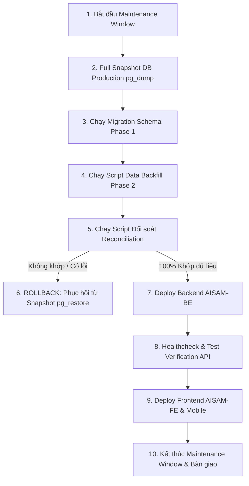

# ROLLOUT & DEPLOYMENT RUNBOOK (PHASE 8)
**Dự án:** AISAM — Migrate Flat RBAC → Decoupled Team-Based Scoped RBAC  
**Chiến lược:** Big-Bang Deployment có DB Snapshot & Rehearsal trên Staging (theo Quyết định D-05)  
**Ngày chuẩn bị:** 12/09/2026  

---

## 1. TỔNG QUAN TIẾN TRÌNH ROLLOUT



---

## 2. CHECKLIST CHI TIẾT TRƯỚC VÀ TRONG KHI ROLLOUT

### Bước 1: Khởi động Maintenance Window & Thông báo
- Thông báo tới toàn bộ người dùng và quản trị viên về cửa sổ bảo trì (dự kiến 30–45 phút).
- Tạm dừng các cron job định kỳ đăng bài tự động hoặc đưa sang chế độ hàng đợi tạm thời (`HOLD`).

---

### Bước 2: Tạo Snapshot Database Production
Chạy lệnh backup nhị phân toàn diện (schema + data + blobs):

```bash
# Đặt biến thời gian snapshot
TIMESTAMP=$(date +"%Y%m%d_%H%M%S")

# Thực hiện snapshot database production
pg_dump \
  -h $PROD_DB_HOST \
  -p $PROD_DB_PORT \
  -U $PROD_DB_USER \
  -d $PROD_DB_NAME \
  -F c -b -v \
  -f "aisam_prod_snapshot_${TIMESTAMP}.dump"
```

> [!CAUTION]
> Xác nhận file `aisam_prod_snapshot_${TIMESTAMP}.dump` có dung lượng hợp lệ (> 0 bytes) trước khi chuyển sang bước tiếp theo.

---

### Bước 3: Chạy Migration Schema (Phase 1)
Áp dụng migration EF Core để cập nhật cấu trúc bảng (`team_members.role` integer, FK `contents.team_id`, composite index):

```bash
cd AISAM-BE
dotnet ef database update \
  --project AISAM.Repositories/AISAM.Repositories.csproj \
  --startup-project AISAM.API/AISAM.API.csproj \
  --connection "$PROD_CONNECTION_STRING"
```

---

### Bước 4: Chạy Data Migration & Backfill (Phase 2)
Thực thi script SQL an toàn [`Phase2LegacyDataMigration.sql`](file:///c:/tai%20lieu/AISAM-FINAL/Phase2LegacyDataMigration.sql):
- Tự động tạo bảng backup dữ liệu cũ `_backup_legacy_workspace_members` và `_backup_legacy_contents`.
- Tạo "Default Team" cho từng Workspace chưa có team.
- Backfill `Content.TeamId` từ null sang Default Team (khắc phục 542 content legacy).
- Sinh bản ghi `TeamMember` (Role = Manager) cho các Workspace Manager cũ tại các Team tương ứng.
- Di chuyển vai trò phẳng của `WorkspaceMember` sang `Member` (role = 3).

```bash
psql -h $PROD_DB_HOST -p $PROD_DB_PORT -U $PROD_DB_USER -d $PROD_DB_NAME \
  -f Phase2LegacyDataMigration.sql
```

---

### Bước 5: Chạy Đối Soát & Kiểm Toán Dữ Liệu (Reconciliation)
Chạy script kiểm tra toàn vẹn [`Phase2DataMigrationReconciliation.sql`](file:///c:/tai%20lieu/AISAM-FINAL/Phase2DataMigrationReconciliation.sql):

```bash
psql -h $PROD_DB_HOST -p $PROD_DB_PORT -U $PROD_DB_USER -d $PROD_DB_NAME \
  -f Phase2DataMigrationReconciliation.sql
```

**Tiêu chuẩn nghiệm thu (Pass Criteria):**
1. `unassigned_content_count == 0` (100% content đều có `team_id` hợp lệ).
2. `legacy_role_count == 0` (Không còn role cũ 2 ở bảng `workspace_members` mà chưa được map sang team_members).
3. `duplicate_team_member_count == 0` (Không có duplicate active membership).

---

### Bước 6: Xử Lý Tình Huống Khẩn Cấp (Rollback Runbook)
Nếu Bước 5 phát hiện bất kỳ sai lệch dữ liệu nào:
> [!WARNING]
> **TUYỆT ĐỐI KHÔNG CỐ GẮNG "VÁ TIẾP" TRÊN DỮ LIỆU ĐÃ LỖI.**  
> Tiến hành phục hồi ngay lập tức về bản snapshot đã chụp ở Bước 2.

```bash
# 1. Đóng toàn bộ kết nối hiện tại tới DB
psql -h $PROD_DB_HOST -p $PROD_DB_PORT -U $PROD_DB_USER -d postgres -c \
  "SELECT pg_terminate_backend(pid) FROM pg_stat_activity WHERE datname = '$PROD_DB_NAME' AND pid <> pg_backend_pid();"

# 2. Xóa và tạo lại database rỗng
dropdb -h $PROD_DB_HOST -p $PROD_DB_PORT -U $PROD_DB_USER $PROD_DB_NAME
createdb -h $PROD_DB_HOST -p $PROD_DB_PORT -U $PROD_DB_USER $PROD_DB_NAME

# 3. Phục hồi toàn vẹn từ snapshot
pg_restore -h $PROD_DB_HOST -p $PROD_DB_PORT -U $PROD_DB_USER \
  -d $PROD_DB_NAME -v "aisam_prod_snapshot_${TIMESTAMP}.dump"
```

---

### Bước 7: Deploy Backend API (`AISAM-BE`)
Deploy source code backend mới (chứa `EffectivePermissionContext`, `AccessControlService`, EF Core Query Filter):

```bash
# Build production bundle
dotnet publish AISAM-BE/AISAM.API/AISAM.API.csproj -c Release -o /var/www/aisam-api

# Khởi động lại service
sudo systemctl restart aisam-api
sudo systemctl status aisam-api
```

---

### Bước 8: Kiểm Tra Sức Khỏe Hệ Thống (Healthcheck & Smoke Test)
- Gọi `/api/health` xác nhận HTTP 200 OK.
- Thử nghiệm đăng nhập tài khoản Owner, WorkspaceManager, Member (Creator, Viewer) trên staging/prod.
- Kiểm tra tính cô lập của danh sách bài viết theo đúng Team.

---

### Bước 9: Deploy Frontend (`AISAM-FE`) & Mobile App (`AISAM-MB`)
Sau khi Backend hoạt động ổn định:
- **Frontend:**
  ```bash
  cd AISAM-FE
  npm run build
  pm2 restart aisam-fe
  ```
- **Mobile App:** Phát hành bản cập nhật Flutter lên App Store / Google Play TestFlight / Internal Track.

---

### Bước 10: Hoàn Tất Bảo Trì
- Mở lại lưu lượng cho người dùng bình thường.
- Bật lại scheduler cron jobs đăng bài.
- Theo dõi log hệ thống trong 24 giờ đầu tiên.
