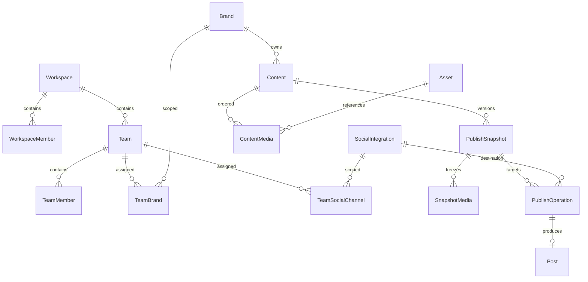

# T00 — Contract triển khai đã chốt

Ngày: 07/09/2026. Áp dụng cùng [decision log](PERMISSION_PUBLISHING_DECISIONS.md) và [database preflight](T00_DATABASE_PREFLIGHT.md). Đây là thiết kế để triển khai, không phải mô tả endpoint mới đã tồn tại.

## 1. Kết luận schema và phương án migration

Preflight đã chạy trên database cấu hình trong API bằng giao dịch **READ ONLY, REPEATABLE READ**. Có 61 Team, 35 TeamBrand, 66 TeamMember, 542 Content, 179 Post, 139 lịch, 147 Integration và 0 Asset tại thời điểm đo.

**Database và checkout không đồng bộ:** database đã có `teams.workspace_id NOT NULL`, `contents.primary_creator_id`, `contents.video_urls`; còn model C# chưa phản ánh các field này. Toàn bộ 61 Team có workspace trực tiếp hợp lệ nhưng profile_id trống. Unique Team–Brand và Team–User cũng đã có ở database. Lịch sử migration có các bản PermissionAccessControl/ExecutionAttribution/ContentOwnershipBoundary chưa xuất hiện trong tập migration của checkout hiện tại.

Vì vậy **không áp dụng đề xuất ban đầu “backfill Team từ Profile” lên database này**. T01 thực hiện theo thứ tự:

1. Đối chiếu migration history, snapshot và schema; lập migration hòa giải có tiền điều kiện rõ cho database mới và database đã nâng cấp.
2. Map Team.WorkspaceId trực tiếp, ProfileId nullable. Giữ FK/unique hiện có, không AddColumn/index trùng.
3. Dùng `primary_creator_id` làm attribution Creator chuẩn nếu đối soát nguồn dữ liệu đạt; không thêm `created_by_user_id` song song cùng nghĩa. Dữ liệu null vẫn null đến khi có nguồn chứng minh actor.
4. Tái sử dụng `video_urls` để đọc legacy nhiều video; media collection mới phải có đường nhập từ URL, vì bảng Asset hiện trống.
5. Có **1 Post lệch Brand hoặc workspace so với Integration**. Đưa vào danh sách cách ly để đối soát trong T01; không tự chuyển Brand, xóa bài hay cấp quyền dựa trên dữ liệu này.
6. Không phát hành scope enforcement trước khi resolver đọc đúng schema và các test legacy đạt.

Preflight không thay thế backup. Trước migration staging: backup → kiểm tra restore → chạy migration → so sánh số bản ghi/quan hệ → smoke test → lưu báo cáo. Rollback ứng dụng phải giữ dữ liệu mới; không drop cột lịch sử khi chưa xuất bản phục hồi.

### ERD mục tiêu ở mức quan hệ

Tên bảng mới là tên thiết kế; T01/T06 phải đối chiếu bảng tương đương đã có trong database trước khi tạo. SnapshotMedia lưu URL/storage version và metadata bất biến ngoài AssetId. PublishOperation riêng giữ trạng thái job; Post giữ ý nghĩa bài đã đăng và PublishedAt thực.

## 2. Permission matrix cuối

Mọi ô cho phép đều yêu cầu user/membership hoạt động, resource đúng workspace và workspace không Deleted. `B` = Brand được gán; `C` = kênh thuộc Brand đó được gán; `Own` = Creator thực tế, không phải chủ Profile.

| Hành động | Owner | Manager | ContentCreator | Viewer |
|---|---|---|---|---|
| Billing | Có, kể cả read-only | Không | Không | Không |
| Xem Brand | Toàn workspace | B | B | B |
| Sửa Brand/quản lý assignment | Có | B, không được mở rộng scope của mình | Không | Không |
| Tạo nội dung | Có | B | B | Không |
| Xem Content/Post | Toàn workspace | B | B + Own; có thể cấp view_all_creators | Không |
| Sửa/xóa nội dung | Có | B | B + Own | Không |
| Review | Có | B | B + approval.review qua queue được giao | Không |
| Publish/schedule | Có | B + C + CanPublish | B + Own + C + CanPublish + post.publish | Không |
| Xem social | Có | B + C | B + C | B + C |
| Quản lý social | Có | B + C + CanManage | Không | Không |
| Analytics tổng/member | Có | B và Team quản lý | Chỉ self-performance trong B | Không |

Read-only chặn mọi mutation nội dung/assignment, ngoại lệ billing Owner. Quyền review riêng không cấp API lịch sử toàn bộ. View-all không cấp edit/publish. Gộp grant từ các Team chỉ trong cùng workspace/Brand; Team bị xóa/inactive và membership inactive không đóng góp quyền. Không dùng chuỗi TeamMember.Role như workspace role. JSON permissions cũ không tự trở thành grant đáng tin; kiểm tra/chuẩn hóa ở T01.

Manager không được tự thêm mình hoặc Team mình vào Brand ngoài phạm vi; thao tác mở phạm vi ban đầu thuộc Owner. Không cho sửa role Owner thông qua API Team.

## 3. API contract v1

JWT và `X-Workspace-Id` bắt buộc cho các API mới. Actor lấy từ JWT, target từ resource thật. Body không nhận WorkspaceId/CreatedBy/PublishedBy tự do. Response giữ GenericResponse hiện tại.

| Method/path | Request | Response data |
|---|---|---|
| GET /api/brands/{brandId}/access | Không | `{ brandId, revision, teams:[{teamId,isActive}] }` |
| PUT /api/brands/{brandId}/teams/{teamId} | `{ expectedRevision }` | `{ revision }` |
| DELETE cùng path | If-Match/revision | `{ revision }` |
| GET /api/social/integrations/{id}/teams | Không | `{ integrationId, revision, teams:[{teamId,canView,canPublish,canManage}] }` |
| PUT /api/social/integrations/{id}/teams/{teamId} | `{canView,canPublish,canManage,expectedRevision}` | `{revision}` |
| DELETE cùng path | If-Match/revision | `{revision}` |
| GET /api/team/member-performance | from,to,brandId?,teamId?,memberId?,page,pageSize | `{items,total,from,to,metricDefinitions,updatedAt}` |
| GET /api/social/integrations/{id}/publishing-capabilities | Không | `{platform,adapterVersion,modes,limits,available,unavailableReason}` |
| PUT /api/content/{id}/media | `{expectedVersion,items:[{assetId,sortOrder,altText,isCover}]}` | Content media theo thứ tự và version mới |
| POST /api/content/{id}/publish-operations | `{expectedVersion,integrationIds,scheduledAt?,idempotencyKey}` | `{snapshotId,operations:[{id,integrationId,status}]}` |
| GET /api/publish-operations/{id} | Không | Trạng thái, media item errors, attempts; không có provider token |

Các route publish mới coexist với route cũ qua adapter trong giai đoạn chuyển đổi; không xóa contract mobile cũ cùng lúc thêm collection. Server từ chối ID trùng/thứ tự trùng, item ngoài scope và trường quyền trái kiểu. Page size mặc định 20, tối đa 100. Revision mismatch trả 409; assignment update và audit trong cùng transaction. Grant phải đồng thời kiểm tra Team/Brand/Integration cùng workspace.

### Error convention

| HTTP | Code | Điều kiện |
|---|---|---|
| 401 | Theo auth hiện tại | Phiên AISAM không hợp lệ |
| 404 | RESOURCE_NOT_FOUND | Resource không tồn tại hoặc người gọi không có quyền nhìn; không tiết lộ Brand/owner |
| 403 | ACCESS_DENIED_BRAND / ACCESS_DENIED_CHANNEL / CONTENT_NOT_OWNED | Resource nhìn được nhưng action bị cấm |
| 409 | ACCESS_REVISION_CONFLICT / CONTENT_VERSION_CONFLICT | Dữ liệu thay đổi trong lúc sửa |
| 409 | SOCIAL_REAUTH_REQUIRED | OAuth social cần kết nối lại; không xóa phiên AISAM |
| 400 | MEDIA_LIMIT_EXCEEDED / MEDIA_TYPE_UNSUPPORTED | Không đạt capability hoặc schema |
| 422 | PUBLISH_PROVIDER_REJECTED | Provider từ chối nội dung |
| 502 | MEDIA_UPLOAD_FAILED | Lỗi tạm thời phía provider; trạng thái item lưu riêng |

Filter chỉ định Brand/Team ngoài phạm vi trả lỗi theo convention trước aggregate; list không có filter tự áp scope. Không trả count toàn workspace rồi lọc items.

## 4. Capability và lựa chọn phạm vi demo

**Phạm vi chốt:** Facebook Page, Instagram Professional, TikTok. Google publishing loại khỏi đợt này vì GoogleProvider.PublishAsync đang ném NotSupportedException; đăng nhập Google vẫn giữ nguyên.

| Provider | Mã AISAM hiện tại | Target thiết kế | Điều kiện mở tính năng |
|---|---|---|---|
| Facebook Page | Nhiều ảnh bằng attached_media; video đơn | Giữ ảnh đơn/nhiều ảnh và video đơn; mixed/multi-video tắt | Adapter test và tài khoản Page hợp lệ |
| Instagram | Carousel ảnh; Reel đơn; chặn ảnh+video | Carousel tối đa 10 item gồm ảnh/video/mixed theo tài liệu Meta | Video child processing và sandbox test ở T07 trước khi bật |
| TikTok | Một video, query creator trước init | Video đơn; photo collection ở nhánh adapter riêng; mixed/multi-video tắt | Photo adapter + URL domain verification + quyền tài khoản |
| Google | Publishing chưa triển khai | available=false | Ngoài phạm vi đợt đầu |

Nguồn chính thức: tài liệu Meta mô tả carousel gồm tối đa 10 ảnh/video và các media container; cần media URL truy cập được từ máy chủ Meta. [Meta Instagram API](https://www.postman.com/meta/instagram/documentation/6yqw8pt/instagram-api?entity=request-23987686-ab559ffb-8e2c-4b0a-b43a-5737b6d2f672)

TikTok Photo API nhận tối đa 35 URL ảnh, yêu cầu URL được xác minh; Direct Post cần scope phù hợp. Video dùng flow query creator → init → upload. [TikTok Photo](https://developers.tiktok.com/docs/en/content-posting-api-reference-photo-post), [TikTok Direct Post](https://developers.tiktok.com/doc/content-posting-api-reference-direct-post)

SDK chính thức Meta có trường attached_media; không dùng trường này làm bằng chứng hỗ trợ mixed/multi-video. Giới hạn mới chưa chứng minh sẽ bị tắt; giữ giới hạn ảnh bảo thủ hiện tại của AISAM trong đợt chuyển đổi. [Meta SDK](https://github.com/facebook/facebook-python-business-sdk/blob/main/facebook_business/adobjects/post.py)

Không công bố file size/duration chung cho mọi mode. Capability DTO chứa giới hạn theo media type/mode, lấy cấu hình versioned và metadata tài khoản; missing limit nghĩa mode chưa sẵn sàng, không có nghĩa vô hạn. Giới hạn nội bộ upload có thể thấp hơn giới hạn nền tảng và phải ghi rõ trong UI.

**T00 chốt thiết kế và fallback, không chứng nhận đăng thật trên tài khoản demo.** Thử upload/publish sandbox, quyền OAuth/account cụ thể và limit từng adapter là tiêu chí T07/T11 trước khi enable; không cần đăng bài thật để đóng task thiết kế.

## 5. Snapshot, state machine và migration media

- Upload tạo Asset độc lập có phạm vi; không cho trình duyệt tự gắn uploader/tenant. MIME và size kiểm tra ở backend.
- ContentMedia là draft mutable, SortOrder unique theo Content. Snapshot lưu text/version/media và checksum/URL version; draft thay đổi không sửa snapshot.
- Submit tạo revision cần duyệt; approval gắn revision. Schedule chỉ snapshot revision được duyệt; chỉnh sửa sau duyệt cần vòng duyệt mới.
- PublishOperation unique theo idempotency key + integration, gắn actor/snapshot/occurrence. Recurring mỗi occurrence có operation mới.
- Queued → UploadingMedia → Publishing → Published. Permission/OAuth → NeedsAttention; lỗi payload → Failed; lỗi tạm thời → retry có backoff/budget. Cancelled chỉ trước điểm publish không thể thu hồi.
- Timeout sau khi gửi thành công không rõ kết quả → NeedsAttention/reconciliation, không tạo post lần hai bằng retry mù.
- PartiallyPublished là trạng thái tổng hợp nhiều đích; từng operation có trạng thái riêng. Không coi carousel thiếu một item là Published.
- Team/permission đổi phải re-check trước publish. Thu hồi sau khi provider đã commit không thể đảm bảo hủy tác động ngoài hệ thống; ghi audit và thông báo kết quả thực tế.
- URL legacy không tự trở thành Asset đáng tin: backfill metadata/quan hệ từ dữ liệu đã đối soát, không tải URL tùy ý qua network để tránh SSRF. URL chưa xác nhận được giữ trong legacy draft, không auto-publish dưới flow mới.

## 6. Rich Text và KPI

Editor schema v1: doc/paragraph/text, heading giới hạn, bullet/ordered list, bold/italic/underline/highlight, link allow-list http/https. Không script, iframe, event handler hoặc URL javascript/data. Hashtag là text có chuẩn hóa; PlainText do formatter từ JSON sinh, không tin bản plain text client khác JSON. Lưu version và snapshot formatter; provider không hỗ trợ semantic thì dùng plain text.

KPI filter trước aggregate; khoảng UTC [from,to). ContentsCreated theo actor và CreatedAt; PublishedPosts theo Post thành công, đếm mỗi đích một bài. ApprovalRate theo submission revision có kết quả, không lấy toàn bộ Draft làm mẫu số. On-time tính theo occurrence thành công trong ±5 phút, công bố cả số pending/failed. Turnaround theo các timestamp thực; thiếu timestamp trả null. Insights dùng bản ghi xác định mới nhất cho mỗi Post/metric period, không cộng chồng snapshot cumulative. EngagementRate dùng impressions, reach báo riêng. Creator null loại khỏi leaderboard cá nhân và xuất số lượng Unattributed riêng cho Owner để không làm giả KPI.

## 7. Test data và migration gate

Fixture gồm 2 workspace; mỗi workspace có Brand/kênh; workspace chính có Alpha/Beta, Owner, Manager A/B, Creator A/B, Viewer. Có grant active/revoked, Content của mỗi Creator, một legacy null actor và một Post lệch kênh.

Mỗi fixture chạy list/detail/search/count/export/analytics và API trực tiếp. Test lịch gồm recurring, retry sau timeout, revoke trước publish, đổi draft sau schedule. Media fixture gồm 5 ảnh reorder, 2 video carousel, mixed không hỗ trợ, MIME giả, asset ngoài scope và HTML nguy hiểm.

Preflight là cổng vào T01, không phải auto-fix. T01 hoàn thành khi schema/model/migration được hòa giải, một Post lệch đã có quyết định xử lý, dữ liệu attribution chưa rõ được giữ riêng và migration/rollback staging có bằng chứng. Chưa chạy database update trong T00.

## 8. Bằng chứng hoàn thành T00

- Model/entity/mapping và các đường tạo Content đã khảo sát: ContentService create/clone/publish, AIService, AutomationGenerationService, PostInsightsSyncService import, ContentScheduleService.
- [Permission decisions](PERMISSION_PUBLISHING_DECISIONS.md) + matrix mục 2 đã khóa theo ủy quyền.
- [Preflight](T00_DATABASE_PREFLIGHT.md) chạy thành công; công cụ tại `AISAM-BE/tools/PermissionPreflight` tái chạy được từ thư mục AISAM-BE.
- ERD, migration strategy, API/error contract, capability/fallback và fixtures đã đủ để bắt đầu T01.
- Không còn quyết định nghiệp vụ cần hỏi trước T01; sandbox provider và rollout production có gate cụ thể ở T07/T11.
